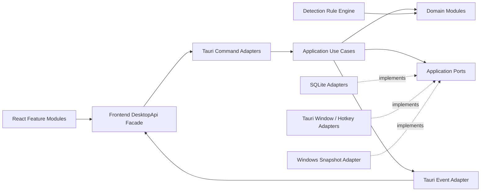
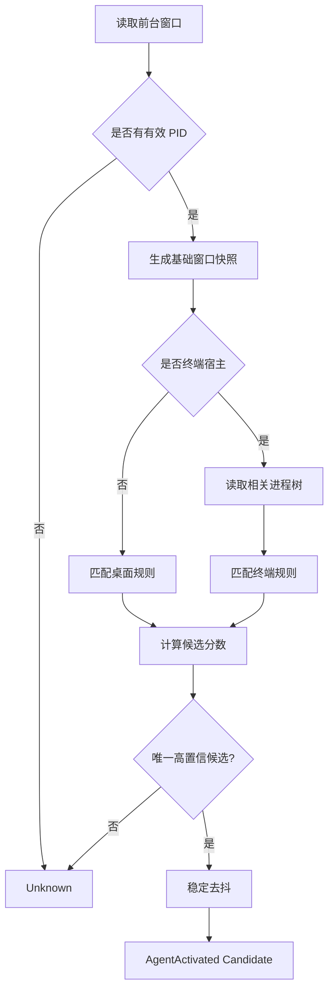
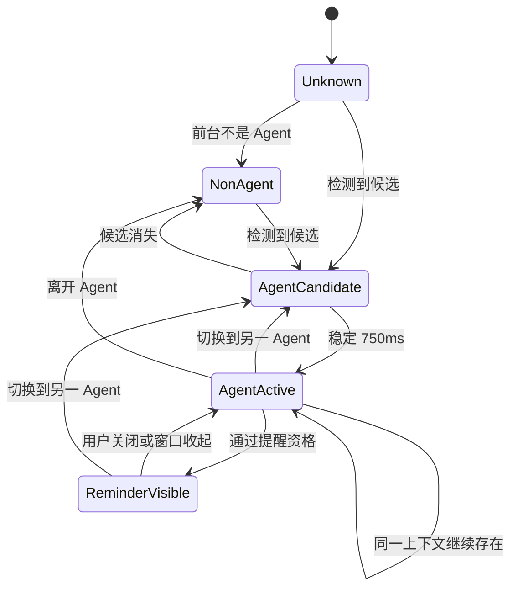
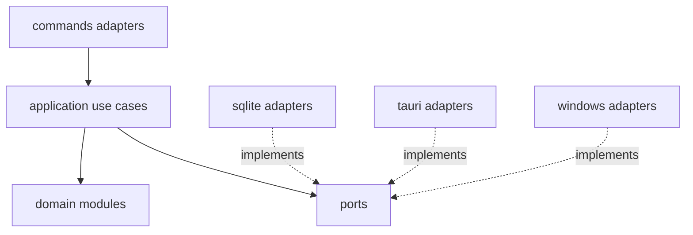
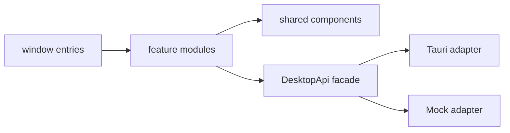

# AgentTips 完整设计规格

---

<!-- Source: README.md -->

# AgentTips 设计文档包

**版本：** v1.1  
**日期：** 2026-08-06  
**目标平台：** Windows 10/11 x64  
**技术路线：** Tauri 2 + React + TypeScript + Rust + SQLite

## 1. 文档用途

本目录用于指导 Claude Code、Codex、OpenCode、Cursor Agent 等代码 Agent 实现 AgentTips。Agent 必须先阅读本文件、根目录 `AGENTS.md` 以及 `docs/` 下全部文档，再开始修改代码。

AgentTips 是一个面向桌面和终端 AI Agent 的本地便签工具：用户通过可录制的全局快捷键快速创建一张新便签，将其绑定到一个或多个 Agent，并决定该便签是否在对应 Agent 被激活时自动携带。主快捷键严格采用 `Ctrl + 单个按键`，用户在设置中点击录制控件后直接按下组合键完成配置。每种 Agent 在 15 分钟冷却窗口内只触发一次自动提醒。

## 2. 已冻结的产品边界

MVP 支持以下类别：

- 桌面 Agent：ChatGPT Desktop、Cursor、Trae，以及用户自定义桌面 Agent。
- 终端 Agent：Claude Code、OpenCode、Codex CLI，以及用户自定义终端 Agent。
- Windows 桌面应用、系统托盘、可录制的 `Ctrl + 单键` 全局快捷键、本地 SQLite。

MVP 不包含：

- 浏览器网页 Agent 识别；
- 云同步、账户、团队协作；
- LLM API、自动生成提示词、RAG、Embedding；
- 自动把便签发送给 Agent；
- macOS、Linux；
- MCP Server 与 CLI Wrapper。

## 3. 文档索引

| 文档                                     | 作用                                 |
| ---------------------------------------- | ------------------------------------ |
| `AGENTS.md`                              | 所有代码 Agent 必须遵守的工程规则    |
| `docs/00-product-spec.md`                | 产品目标、术语、范围与核心流程       |
| `docs/01-ux-interaction.md`              | 快捷窗口、主界面、提醒窗口的交互规格 |
| `docs/02-system-architecture.md`         | 前后端边界、模块、线程与窗口架构     |
| `docs/03-domain-data-model.md`           | 领域模型、SQLite 表结构和不变量      |
| `docs/04-agent-detection.md`             | 桌面与终端 Agent 检测规则            |
| `docs/05-reminder-state-machine.md`      | 15 分钟冷却和自动携带状态机          |
| `docs/06-ipc-event-contracts.md`         | Tauri Command、事件与错误契约        |
| `docs/07-ui-visual-design.md`            | UI 视觉系统、布局、状态和动效        |
| `docs/08-testing-acceptance.md`          | 自动验收矩阵、测试策略和发布门禁     |
| `docs/09-implementation-roadmap.md`      | 分阶段实施顺序与阶段退出条件         |
| `docs/10-security-reliability.md`        | 权限、隐私、日志、恢复和性能要求     |
| `docs/11-references.md`                  | 主要官方技术资料                     |
| `docs/12-extensibility-module-design.md` | 模块边界、依赖方向、扩展点和架构验收 |
| `prompts/AgentTips-Agent-Prompts.md`     | 主提示词和分阶段执行提示词           |

## 4. 冲突处理优先级

当文档之间存在冲突时，按以下优先级执行：

1. `docs/00-product-spec.md` 中标记为“冻结”的范围和行为；
2. `docs/05-reminder-state-machine.md` 中的状态机；
3. `docs/03-domain-data-model.md` 中的领域不变量；
4. `docs/08-testing-acceptance.md` 中的验收要求；
5. `docs/02-system-architecture.md` 与 `docs/12-extensibility-module-design.md` 的模块边界；
6. 其他文档；
7. Agent 自己的偏好。

禁止 Agent 为了“更完整”而主动扩大范围。任何没有写入 MVP 的能力，都应记录到 Future Work，而不是直接实现。

---

<!-- Source: AGENTS.md -->

# AgentTips Agent 工程规则

本文件适用于整个仓库。任何代码 Agent 在修改代码前必须阅读全部设计文档。

## 1. 基本工作方式

1. 先检查仓库实际状态，不假定文件、依赖或功能已经存在。
2. 一次只执行当前提示词指定的阶段，不提前实现后续阶段。
3. 修改前列出：目标、受影响模块、风险和验收命令。
4. 修改后必须运行当前阶段要求的自动验收。
5. 不得通过删除测试、降低规则、添加忽略项来制造“通过”。
6. 遇到文档与代码冲突时，以设计文档为目标，先报告差异再修复。
7. 不创建未被需求要求的服务端、账号、云存储、AI API 或浏览器扩展。

## 2. 技术边界

### React / TypeScript 负责

- 主窗口、快捷新建窗口、提醒窗口；
- 表单、列表、搜索、筛选、主题和动效；
- 调用强类型 Tauri Commands；
- 监听 Rust 发出的领域事件；
- 展示错误，不决定业务规则。

### Rust 负责

- SQLite、迁移、事务和领域不变量；
- 全局快捷键录制后的权威校验、注册、回滚，托盘、单实例和多窗口生命周期；
- Windows 前台窗口和进程树读取；
- Agent 识别、去抖、冷却与提醒资格判断；
- 自动携带便签查询；
- 日志、恢复和发布配置。

### 禁止

- React 直接执行 SQL；
- React 自己计算 15 分钟冷却；
- Rust 中拼装 UI 文案和视觉布局；
- 同一条业务规则在 TypeScript 和 Rust 各实现一遍；
- 为每种 Agent 复制一套独立检测代码；
- 将所有逻辑堆进 `App.tsx`、`lib.rs` 或单个 service 文件；
- 允许 `Ctrl + Alt + 键`、自由字符串或仅前端校验绕过 `Ctrl + 单键` 约束；
- feature 组件直接调用 `invoke/listen`，或 domain 导入 Tauri/SQLite/Windows。

## 3. 模块与扩展规则

- 必须阅读并遵守 `docs/12-extensibility-module-design.md`。
- Rust 采用 domain → application/ports ← adapters 的依赖方向。
- React 采用 feature → DesktopApi facade → adapter 的依赖方向。
- 新增 Agent 优先增加 AgentRule 与 fixture，不复制 detector。
- 新增外部能力先定义最小 port，再实现 adapter。
- 快捷键模块必须拆分为 `HotkeyRecorder`（前端捕获）、`HotkeyPolicy`（领域校验）、`UpdateHotkey`（用例）和 `HotkeyRegistrar`（平台端口）。
- 每个 feature/domain module 有唯一公开入口，禁止跨模块深层导入私有文件。
- `scripts/acceptance.ps1` 必须包含架构边界检查。

## 4. 快捷键规则

- 默认值为 `Ctrl + F12`。
- 用户只能点击录制控件后按下组合，不能编辑自由文本。
- 合法格式严格为 `Ctrl + 一个支持的非修饰键`；Alt、Shift、Meta 均不得同时存在。
- Esc 取消，失败保持旧值；高冲突组合需要二次确认。
- 前端只生成结构化候选，Rust 必须权威校验、系统注册和持久化。
- 注册、持久化或注销切换失败时必须补偿，不能让用户失去旧快捷键。
- 不记录录制按键历史。

## 5. 依赖规则

- 使用当前稳定版本并提交锁文件，不在文档中随意硬编码未来版本号。
- 新增依赖前说明用途；已有能力能完成时不增加依赖。
- UI 优先使用已有 shadcn/ui 组件和项目级组合组件。
- 原生 Windows 能力使用 Rust `windows` crate 或经过验证的稳定 crate。
- SQLite 由 Rust 数据层访问；MVP 不允许前端使用 Tauri SQL 插件直接查询。

## 6. 数据和时间规则

- 数据库时间统一保存为 UTC RFC 3339 字符串或 UTC 毫秒时间戳；代码中只能选择一种并保持一致。
- 业务时间通过 `Clock` 抽象获取，测试不得依赖真实等待 15 分钟。
- 删除便签采用软删除或明确的事务级硬删除；实现方案必须与数据库文档一致。
- `last_prompted_at` 只在提醒窗口被成功创建并接收有效内容后更新。

## 7. 测试规则

必须保持以下层次：

- TypeScript 单元测试：组件逻辑、表单 schema、前端 adapter；
- React 组件测试：快捷新建、列表、详情和提醒状态；
- 浏览器模式 E2E：使用 Mock Desktop API，不依赖 Tauri 运行时；
- Rust 单元测试：规则引擎、状态机、数据校验；
- Rust 集成测试：SQLite repository、迁移、事务；
- Windows 手动冒烟：真实快捷键、托盘、前台检测与安装包。

若原生功能无法在 CI 中完全自动化，必须通过抽象接口和 fixture 自动验证核心逻辑，并在发布门禁中保留人工冒烟项。

## 8. 完成定义

一个阶段只有同时满足以下条件才算完成：

- 功能按当前阶段文档实现；
- 自动测试通过；
- 构建通过；
- 没有新增高优先级 TODO；
- README 或相关文档已更新；
- 输出修改文件清单、测试结果、已知限制和下一阶段入口。

---

<!-- Source: docs/00-product-spec.md -->

# 00. AgentTips 产品规格

## 1. 一句话定义

AgentTips 是一个 Windows 本地工具：让用户随时用全局快捷键记录一张绑定到 AI Agent 的便签，并在对应 Agent 进入前台时，按可配置的自动携带规则展示相关便签。

## 2. 产品问题

用户在使用多个 AI Agent 时，会不断积累临时提示、项目约束、操作习惯和经验，但这些信息容易散落或被忘记。传统提示词库要求用户主动打开、搜索和复制；AgentTips 将“主动查找”改为“进入正确 Agent 时出现”。

## 3. 术语

| 术语         | 定义                                                        |
| ------------ | ----------------------------------------------------------- |
| Tip / 便签   | 用户记录的一段文本，可绑定多个 Agent                        |
| Agent        | 一个桌面 AI 应用或运行在终端中的 AI CLI                     |
| 绑定         | Tip 与 Agent 的多对多关系                                   |
| 默认携带     | 某条 Tip 在某个 Agent 满足提醒条件时自动出现在提醒窗口      |
| Agent 激活   | 某 Agent 对应的桌面窗口或终端宿主成为前台，且稳定通过检测   |
| 冷却窗口     | 同一种 Agent 两次自动提醒之间的最短间隔，MVP 固定为 15 分钟 |
| 快捷窗口     | 全局快捷键唤起的“只新建、不浏览”窗口                        |
| 快捷键录制器 | 设置页中点击后读取下一次有效 `Ctrl + 单键` 组合的控件       |
| 主窗口       | 查看和管理全部便签、Agent 与设置的完整界面                  |
| 提醒窗口     | Agent 激活时展示自动携带便签的非抢焦点浮层                  |

## 4. 冻结范围

### 4.1 必须实现

1. Windows 10/11 x64 桌面应用。
2. 使用可自定义的全局快捷键打开快捷窗口；组合必须严格为 `Ctrl + 单个支持按键`。
3. 每次快捷键触发默认进入“新建空白便签”，不展示历史便签。
4. 便签支持标题、正文、多个 Agent 绑定。
5. 每个“便签—Agent”绑定可独立选择是否默认携带。
6. 主窗口支持查看、搜索、编辑、归档或删除便签。
7. 支持内置 Agent：ChatGPT Desktop、Cursor、Trae、Claude Code、OpenCode、Codex CLI。
8. 支持用户创建自定义桌面 Agent 或终端 Agent 检测规则。
9. Agent 进入前台时，读取该 Agent 的默认携带便签并按规则展示。
10. 每种 Agent 独立冷却；15 分钟内只允许成功显示一次提醒。
11. 用户可按 Agent 关闭“首次进入自动提醒”。
12. 本地 SQLite 持久化、系统托盘、单实例。
13. 快捷窗口、主窗口、提醒窗口均支持深色模式。
14. 设置页提供快捷键录制控件：用户点击后直接按键，系统读取、校验、注册并保存；失败时保留原快捷键。

### 4.2 明确不实现

- 浏览器标签页、网页内自定义 GPT 或 Claude Project 识别；
- 自动粘贴、自动发送、自动调用 LLM；
- 云同步、账号、团队、多设备；
- MCP、AgentTips CLI Wrapper、IDE 插件；
- 图片、附件、富文本协作；
- macOS、Linux、移动端；
- AI 生成标签、摘要或提示词优化。

## 5. 核心用户故事

### US-01 快速记录

作为用户，我在任意应用中按下快捷键后，应立即看到一个空白便签输入窗口，以便不离开当前思路快速记录。

### US-02 绑定多个 Agent

作为用户，我可以把同一张便签绑定到 Cursor、Claude Code 和 Codex，并分别决定是否在这些 Agent 中自动携带。

### US-03 自动提醒

作为用户，我第一次进入 Cursor 时能看到 Cursor 的默认携带便签；在接下来的 15 分钟内来回切换 Cursor，不会重复打扰。

### US-04 独立冷却

作为用户，我刚在 Cursor 中看到提醒后切换到 Claude Code，Claude Code 仍可独立显示自己的提醒。

### US-05 只管理时看历史

作为用户，按快捷键记录时不想被历史内容干扰；只有主动打开主窗口时才浏览或修改旧便签。

## 6. 快捷窗口与主快捷键规则

### 6.1 主快捷键格式

- 默认主快捷键：`Ctrl + F12`。
- 用户可以修改，但格式必须严格为：一个 `Ctrl` 修饰键，加一个支持的非修饰按键。
- 不接受 `Alt`、`Shift`、`Meta/Windows` 等额外修饰键，因此 `Ctrl + Alt + T`、`Ctrl + Shift + K` 均为无效组合。
- 不接受只有 `Ctrl`、只有普通键、多个普通键或纯修饰键。
- `Esc` 在录制状态下只用于取消，不可作为主快捷键。
- 支持按键集合由领域值对象统一定义，MVP 至少覆盖 `A-Z`、`0-9`、`F1-F12` 与常见标点键；不得在 React 与 Rust 中维护两份不一致的列表。
- 对 `Ctrl + C`、`Ctrl + V` 等常见高冲突组合，UI 必须给出“可能覆盖系统常用操作”的明确警告；是否可注册仍由 Rust 与操作系统最终判定。

### 6.2 快捷键录制

- 设置页展示当前组合和“点击录制”控件，不允许用户手工输入任意字符串。
- 用户点击控件后进入录制状态，界面显示“请按下 Ctrl + 一个键”。
- `Ctrl` 单独按下时继续等待；按下合法组合后生成候选值。
- `Esc`、点击取消或离开录制控件时取消录制，保留原设置。
- 前端只负责捕获 `KeyboardEvent.code` 并形成候选；Rust 必须再次验证格式、支持集合和注册结果。
- 新组合只有在系统注册与持久化都成功后才成为当前快捷键。
- 冲突、无效组合、注册失败或持久化失败时，原快捷键必须继续可用。
- 不记录用户的连续按键历史，不把录制期间的按键写入日志。

### 6.3 快捷窗口行为

- 每次触发创建一个新的编辑会话，不自动打开最后一张便签。
- 自动聚焦正文编辑区。
- 当前检测到 Agent 时，可预选该 Agent，但不强制绑定。
- 标题可为空；保存时可使用正文首个非空行生成显示标题。
- `Ctrl + Enter` 保存；`Esc` 关闭。
- 空白便签关闭时不保存。
- 非空未保存内容关闭时，MVP 采用“保存草稿或确认丢弃”中的一种固定策略；推荐自动保存为草稿，并在主窗口显示“草稿”状态。

## 7. 默认携带规则

默认携带是 `TipAgentBinding` 的属性，而不是 Tip 全局属性。

示例：

| Tip              | Agent       | 默认携带 |
| ---------------- | ----------- | -------- |
| 修改前解释调用链 | Cursor      | 是       |
| 修改前解释调用链 | ChatGPT     | 否       |
| 修改前解释调用链 | Claude Code | 是       |

Agent 激活时只展示该 Agent 下 `auto_attach = true` 且便签未归档的内容。`auto_attach = false` 的绑定只用于主窗口筛选，不自动展示。

## 8. Agent 激活定义

“打开 Agent”在 MVP 中定义为：

> Agent 对应窗口成为系统前台窗口，并在去抖时间内保持可识别状态。

以下情况不是新的激活：

- Agent 仅在后台运行；
- Cursor 内切换文件或面板；
- 同一终端 Agent 内输入命令；
- 检测结果短暂抖动后仍为同一 Agent。

从非 Agent 或另一 Agent 切换到目标 Agent时，产生候选激活事件。是否展示由提醒状态机决定。

## 9. 成功指标

MVP 的产品成功不使用用户增长指标，而用可用性指标：

- 当前已注册快捷键到可输入状态的感知延迟低于 300 ms（普通开发机目标）；
- 用户可以通过录制控件修改为合法 `Ctrl + 单键`，重启后仍生效；
- 创建便签的主要流程不超过一次窗口唤起、输入、选择 Agent、保存；
- 同一 Agent 15 分钟内不重复提醒；
- 不存在因后台进程运行而错误弹窗；
- 用户无需联网即可完整使用；
- 自动提醒不抢夺当前 Agent 的键盘焦点。

---

<!-- Source: docs/01-ux-interaction.md -->

# 01. UX 与交互设计

## 1. 设计原则

1. **快：** 快捷窗口应像系统命令面板，而不是完整笔记应用。
2. **静：** 自动提醒不抢焦点、不播放声音、不频繁弹出。
3. **清：** 一眼看到便签内容、绑定 Agent 和默认携带状态。
4. **可撤销：** 删除、关闭草稿、修改绑定必须有明确反馈。
5. **键盘优先：** 核心创建流程无需鼠标也能完成。

## 2. 窗口模型

应用包含三个独立 Tauri WebviewWindow：

| 窗口标签     | 用途             | 默认行为                       |
| ------------ | ---------------- | ------------------------------ |
| `main`       | 管理全部内容     | 普通可聚焦窗口，可最小化到托盘 |
| `quick-note` | 只创建新便签     | 快捷键唤起并聚焦，保存后隐藏   |
| `reminder`   | 自动展示携带便签 | 置顶、不抢焦点、可收起         |

三个窗口复用同一套前端代码，通过窗口标签选择不同入口，不复制三套应用。

## 3. 快捷新建窗口

### 3.1 布局

```text
┌────────────────────────────────────────────┐
│ New Tip                               Esc  │
├────────────────────────────────────────────┤
│ 写下要提醒自己的内容……                    │
│                                            │
│                                            │
├────────────────────────────────────────────┤
│ Agents  [Cursor ×] [Claude Code ×]  [+]   │
│                                            │
│ 每个 Agent： [携带开关]                    │
├────────────────────────────────────────────┤
│ Ctrl+Enter 保存              打开主界面 ↗  │
└────────────────────────────────────────────┘
```

### 3.2 行为

- 打开时正文获得焦点。
- 标题默认不展示，可通过“添加标题”展开。
- 当前 Agent 被可靠识别时，作为推荐项预选。
- 添加 Agent 后，默认携带开关的初始值为“开”；用户可逐项关闭。
- 保存成功后显示不超过 1 秒的轻反馈，然后窗口隐藏。
- 保存失败时保留内容，展示可复制的错误信息，不关闭窗口。
- 关闭空白窗口不产生记录。
- 快捷窗口禁止出现历史列表、搜索框和复杂设置。

### 3.3 键盘操作

| 操作                      | 快捷键             |
| ------------------------- | ------------------ |
| 保存                      | `Ctrl + Enter`     |
| 关闭                      | `Esc`              |
| 打开 Agent 选择器         | `Ctrl + Shift + A` |
| 切换当前 Agent 的携带状态 | `Ctrl + Shift + D` |
| 打开主界面                | `Ctrl + Shift + O` |

表中快捷键属于快捷窗口内部操作，不等同于可配置的系统主快捷键。系统主快捷键只能在设置页通过录制控件修改，并严格限制为 `Ctrl + 单个支持按键`。

## 4. 主窗口

### 4.1 信息架构

建议使用三栏结构：

```text
┌──────────────┬──────────────────────┬────────────────────────┐
│ 导航与Agent  │ Tip 列表             │ Tip 详情                │
│              │                      │                        │
│ 全部         │ 修改前解释调用链      │ 标题                    │
│ 默认携带     │ 完成后运行测试        │ 正文                    │
│ 草稿         │ 不做无关重构          │                        │
│ 已归档       │                      │ 绑定 Agent              │
│              │                      │ Cursor    携带：开       │
│ Cursor       │                      │ ChatGPT   携带：关       │
│ Claude Code  │                      │                        │
└──────────────┴──────────────────────┴────────────────────────┘
```

窄窗口下允许退化为两栏或单栏，但桌面默认使用三栏。

### 4.2 列表功能

- 搜索标题和正文；
- 按 Agent、默认携带、草稿、归档筛选；
- 默认按 `updated_at` 倒序；
- 卡片显示标题、正文摘要、Agent 标签、更新时间；
- 支持键盘上下选择；
- 空状态提供“新建 Tip”按钮。

### 4.3 详情编辑

- 标题、正文、Agent 绑定即时编辑；
- 使用短防抖自动保存，或显式保存；MVP 推荐显式保存以减少状态复杂度；
- Agent 绑定区逐项显示默认携带开关；
- 归档和删除放入更多菜单，避免误触；
- 删除需要确认，可提供短暂撤销。

## 5. 自动提醒窗口

### 5.1 目标

提醒窗口是轻量上下文提示，不是通知中心，也不是强制模态框。

### 5.2 外观

```text
┌──────────────────────────────────┐
│ Cursor                     3 Tips│
├──────────────────────────────────┤
│ 1. 修改前先解释调用链            │
│ 2. 完成后运行全部测试            │
│ 3. 不要修改无关模块              │
├──────────────────────────────────┤
│ 查看全部   复制全部   本次关闭   │
└──────────────────────────────────┘
```

- 默认显示在当前屏幕右侧靠上或右下的安全区域；
- 不遮挡任务栏；
- 不自动取得键盘焦点；
- 默认展示最多 3 条，更多内容显示计数；
- 5 秒后可收缩为胶囊，但不应完全消失，除非用户选择关闭；
- 点击后才允许聚焦和滚动；
- 一次 Agent 激活只创建一个聚合提醒窗口。

### 5.3 操作

- `查看全部`：打开主窗口并过滤当前 Agent；
- `复制全部`：按顺序复制当前携带内容，不自动发送；
- `本次关闭`：关闭当前窗口，不改变便签配置；
- `不再自动提醒此 Agent`：放在二级菜单，需要确认。

## 6. 系统托盘

托盘菜单包含：

- 新建 Tip；
- 打开 AgentTips；
- 暂停自动提醒 / 恢复；
- 设置；
- 退出。

关闭主窗口默认隐藏到托盘，不退出进程。只有托盘“退出”或明确的退出命令才终止应用。

## 7. 主快捷键设置与录制控件

### 7.1 设置页布局

```text
┌──────────────────────────────────────────┐
│ 全局新建快捷键                           │
│                                          │
│ [ Ctrl ] + [ F12 ]       [点击重新录制]  │
│                                          │
│ 仅支持 Ctrl + 一个键                     │
└──────────────────────────────────────────┘
```

录制控件不是文本输入框，不允许粘贴诸如 `Ctrl+Alt+T` 的字符串。

### 7.2 录制状态机

| 状态          | 显示与行为                                     |
| ------------- | ---------------------------------------------- |
| `idle`        | 显示当前快捷键，按钮为“点击重新录制”           |
| `recording`   | 高亮控件，显示“请按下 Ctrl + 一个键；Esc 取消” |
| `candidate`   | 展示捕获到的组合和可能的冲突警告               |
| `registering` | 禁止重复提交，显示短进度                       |
| `success`     | 显示新组合，给出轻量成功反馈                   |
| `invalid`     | 显示格式原因，继续录制或取消                   |
| `conflict`    | 显示系统冲突，原快捷键保持不变                 |

### 7.3 捕获规则

- 录制组件获得焦点后监听下一次有效键盘组合，并调用 `preventDefault()`，避免在设置页触发浏览器默认行为。
- 以 `KeyboardEvent.code` 作为候选键标识，避免仅依赖不同键盘布局下变化的字符值。
- `CtrlLeft` 与 `CtrlRight` 均归一化为 `Ctrl`。
- 只有 Ctrl 时继续等待；包含 Alt、Shift 或 Meta 时立即提示格式无效。
- `Esc` 取消；点击控件外部也取消，但不得清空当前快捷键。
- 捕获成功后前端停止监听，只把结构化候选发送给 Rust。
- 高冲突组合需要醒目警告，用户再次确认后才能提交。
- 录制失败时焦点仍停留在控件，便于立即重试。

### 7.4 无障碍要求

- 控件具备 `aria-label`、当前快捷键文本和录制状态说明；
- 状态变化通过 `aria-live` 宣告；
- 不仅依赖颜色区分成功、冲突和无效；
- 键盘用户可以使用 Enter/Space 开始录制，Esc 取消。

## 8. 状态与反馈

| 状态           | UI                               |
| -------------- | -------------------------------- |
| 保存中         | 小型进度指示，不阻塞输入         |
| 保存成功       | 简短文本或勾号，不使用大型 Toast |
| 保存失败       | 就地错误、重试、保留内容         |
| Agent 未识别   | 不自动绑定；可手动选 Agent       |
| Agent 规则冲突 | 设置页显示诊断，不在提醒窗口打扰 |
| 无携带便签     | 不显示提醒窗口                   |
| 自动提醒暂停   | 托盘和设置页显示明显状态         |

## 9. 无障碍

- 所有交互控件有键盘焦点和可读名称；
- 文本与背景达到合理对比度；
- 不仅用颜色表示携带开关；
- 支持 `prefers-reduced-motion`；
- 字体缩放后主要流程仍可用；
- 提醒窗口的自动收缩在“减少动态效果”时关闭。

---

<!-- Source: docs/02-system-architecture.md -->

# 02. 系统架构设计

## 1. 技术栈

- Tauri 2；
- React + TypeScript + Vite；
- Tailwind CSS + shadcn/ui + Lucide；
- Rust；
- SQLite，由 Rust 数据层访问；
- Windows API 与进程信息由 Rust 平台层访问；
- pnpm 作为前端包管理器；
- Vitest、React Testing Library、Playwright；
- Rust 内置测试、Clippy、rustfmt。

依赖版本在项目初始化时选择兼容的稳定版本，并由 `pnpm-lock.yaml` 与 `Cargo.lock` 锁定。

## 2. 架构目标

架构必须同时满足：

1. UI 可以在浏览器 + MockDesktopApi 下独立开发和测试；
2. 领域规则不依赖 Tauri、SQLite、Windows API；
3. 新增 Agent 优先添加数据规则，不复制 detector；
4. 新增提醒方式、平台适配器或存储实现时，不修改便签核心模型；
5. 快捷键捕获、验证、系统注册和持久化分层实现；
6. 每个功能模块有单一职责、公开入口和清晰依赖方向；
7. AI 生成代码时可以按模块局部修改，而不需要理解整个仓库。

## 3. 总体架构



依赖只能指向内层：

```text
UI → Frontend Adapter → Tauri Adapter → Application → Domain / Ports
Infrastructure / Platform ─implements→ Ports
Domain → 不依赖任何外部框架
```

## 4. 功能模块

| 模块          | 核心职责                      | 公开入口                          | 禁止承担                |
| ------------- | ----------------------------- | --------------------------------- | ----------------------- |
| `tips`        | Tip 生命周期、校验、查询      | Tip use cases / repository port   | 窗口、快捷键、检测      |
| `agents`      | Agent 与规则配置              | Agent use cases / repository port | 直接读取 Win32          |
| `bindings`    | Tip-Agent 多对多和 autoAttach | Binding service                   | 冷却状态                |
| `hotkey`      | 快捷键值对象、策略、注册切换  | UpdateHotkey use case             | React 键盘 UI           |
| `detection`   | 快照解析、评分、歧义处理      | ResolveAgent use case             | 弹提醒或写 UI           |
| `activation`  | 去抖、context signature       | Activation service                | 查询便签正文            |
| `reminder`    | 资格、冷却、聚合 payload      | HandleAgentActivated use case     | 读取 Windows 进程       |
| `windows`     | 窗口生命周期和托盘            | WindowController port adapter     | 领域判断                |
| `settings`    | 持久化应用配置                | Settings repository / use cases   | 任意散落 key-value 访问 |
| `diagnostics` | 脱敏诊断快照与日志            | Diagnostics facade                | 存储便签正文日志        |

模块间协作必须通过 use case、port 或稳定 DTO，不得跨目录直接访问另一个模块的私有 repository 或内部状态。

## 5. 前端边界

### 5.1 Frontend Feature Modules

前端以功能目录组织，而不是按 `components/hooks/utils` 全局堆放：

```text
src/features/
├── quick-note/
├── note-library/
├── agent-manager/
├── hotkey-settings/
├── reminder/
├── diagnostics/
└── settings/
```

每个 feature 包含自己的组件、状态、schema 和测试；跨 feature 复用内容进入 `components/shared` 或 `lib`。

### 5.2 DesktopApi Facade

组件中不得散落 `invoke()` 与 `listen()`。统一接口示例：

```ts
export interface DesktopApi {
  createTip(input: CreateTipInput): Promise<TipDto>;
  updateTip(input: UpdateTipInput): Promise<TipDto>;
  listTips(query: TipQuery): Promise<TipPageDto>;
  listAgents(): Promise<AgentDto[]>;
  getHotkey(): Promise<HotkeyBindingDto>;
  updateHotkey(input: HotkeyCandidateDto): Promise<HotkeyUpdateResultDto>;
  openMainWindow(filter?: MainWindowFilter): Promise<void>;
  hideCurrentWindow(): Promise<void>;
  subscribeReminder(handler: (event: ReminderPayload) => void): Unsubscribe;
}
```

生产环境使用 `TauriDesktopApi`，浏览器测试使用 `MockDesktopApi`。

### 5.3 HotkeyRecorder

`HotkeyRecorder` 只负责：

- 进入/退出录制状态；
- 捕获 `KeyboardEvent.code`；
- 生成 `{ modifier: 'Ctrl', keyCode }` 候选；
- 展示格式错误、冲突警告和后端结果。

它不得：

- 自己决定系统是否可注册；
- 直接调用 Tauri global shortcut API；
- 持久化设置；
- 维护一份与 Rust 不同的最终支持键规则。

## 6. Rust 分层与 Ports

### 6.1 Domain

领域层按能力拆分：

```text
src-tauri/src/domain/
├── tips/
├── agents/
├── hotkey/
├── detection/
├── activation/
└── reminder/
```

领域层只包含实体、值对象、纯规则和错误，不引用 `tauri`、SQLite crate、`windows` crate 或全局单例。

### 6.2 Application

应用层按用例命名，而不是建立一个万能 Service：

```text
application/
├── tips/create_tip.rs
├── tips/update_tip.rs
├── hotkey/get_hotkey.rs
├── hotkey/update_hotkey.rs
├── detection/resolve_foreground.rs
└── reminder/handle_agent_activated.rs
```

### 6.3 Ports

关键端口：

```rust
trait TipRepository { /* ... */ }
trait AgentRepository { /* ... */ }
trait SettingsRepository { /* ... */ }
trait ActivationStateRepository { /* ... */ }
trait Clock { /* ... */ }
trait HotkeyRegistrar { /* register / unregister */ }
trait WindowController { /* show / hide / focus policy */ }
trait ForegroundSnapshotProvider { /* snapshot */ }
trait EventPublisher { /* stable domain events */ }
trait ClipboardPort { /* user-triggered copy only */ }
```

应用用例依赖端口，SQLite、Tauri 与 Windows 代码实现端口。

## 7. 快捷键模块设计

### 7.1 领域值对象

```rust
struct HotkeyBinding {
    modifier: RequiredModifier, // 仅 Ctrl
    key_code: SupportedKeyCode,
}
```

`HotkeyBinding` 负责规范化和序列化，不接受任意字符串。`HotkeyPolicy` 负责：

- 必须且只能包含 Ctrl；
- 恰好一个非修饰键；
- 支持键集合；
- Esc 与纯修饰键拒绝；
- 高冲突组合警告分类。

### 7.2 更新用例

`UpdateHotkey` 使用 `HotkeyRegistrar` 和 `SettingsRepository`：

1. Rust 解析并验证候选；
2. 若与当前值相同，幂等返回；
3. 注册新组合；
4. 注册失败时保留旧组合并返回结构化错误；
5. 持久化新值；
6. 持久化失败时注销新组合，旧组合继续有效；
7. 提交内存中的当前 binding；
8. 注销旧组合；若注销失败，旧回调必须通过 generation/current-binding 校验而不再执行业务动作；
9. 发布 `settings/changed`。

快捷键回调只调用 `OpenQuickNote` 用例，不直接查询数据库或执行耗时逻辑。

## 8. 推荐目录

```text
agent-tips/
├── src/
│   ├── app/
│   ├── features/
│   │   ├── quick-note/
│   │   ├── note-library/
│   │   ├── agent-manager/
│   │   ├── hotkey-settings/
│   │   ├── reminder/
│   │   └── diagnostics/
│   ├── components/ui/
│   ├── components/shared/
│   ├── desktop-api/
│   │   ├── contract.ts
│   │   ├── tauri-adapter.ts
│   │   └── mock-adapter.ts
│   ├── schemas/
│   └── styles/
├── src-tauri/
│   ├── src/
│   │   ├── commands/
│   │   ├── application/
│   │   ├── domain/
│   │   ├── ports/
│   │   ├── adapters/
│   │   │   ├── sqlite/
│   │   │   ├── tauri/
│   │   │   └── windows/
│   │   ├── detection/
│   │   ├── events/
│   │   ├── bootstrap/
│   │   └── error.rs
│   └── migrations/
├── e2e/
├── scripts/
└── docs/
```

## 9. 窗口生命周期

### 9.1 主窗口

- 应用启动时可隐藏或显示，首次开发阶段默认显示；
- 关闭行为改为隐藏到托盘；
- 再次启动应用时由单实例插件聚焦主窗口。

### 9.2 快捷窗口

- 启动时预创建并隐藏，减少首次唤起延迟；
- 当前有效快捷键触发时重置为新建状态；
- 定位到当前屏幕中心或上次位置；
- 保存或取消后隐藏，不销毁。

### 9.3 提醒窗口

- 推荐预创建以减少延迟；
- Rust 先确定提醒资格和 payload，再发事件并显示窗口；
- 窗口显示成功后提交 `last_prompted_at`；
- 必须使用不抢焦点的窗口显示方式。

## 10. 后台检测循环

MVP 推荐简单、可测试的轮询：

1. 每 500 ms 读取前台窗口句柄与 PID；
2. 仅当前台 PID 或标题签名变化时读取更详细信息；
3. 终端宿主成为前台时刷新相关进程树；
4. 检测结果稳定 750 ms 后产生候选激活；
5. 相同 `context_signature` 不重复产生候选激活；
6. 将候选激活交给 Reminder 用例，而不是直接弹窗。

## 11. 并发与生命周期

- Windows 检测在可取消后台任务中运行；
- UI Command 不得被检测循环阻塞；
- SQLite 操作保持短事务；
- 不在数据库锁内执行窗口或快捷键注册；
- Event payload 必须拥有数据，不传数据库引用或锁；
- 后台任务和事件监听在退出时释放；
- 快捷键录制仅发生在前端控件聚焦期间，不创建全局键盘监听器。

## 12. 日志

结构化日志至少包含：

- 应用启动与版本；
- 数据库迁移；
- 快捷键候选的结果码、注册成功或冲突（不记录连续按键历史）；
- Agent 候选与最终识别结果；
- 提醒被允许或拒绝的原因码；
- 窗口创建错误；
- 未处理错误。

默认日志不得记录完整便签正文、敏感路径、完整命令行或用户录制期间的原始按键序列。

---

<!-- Source: docs/03-domain-data-model.md -->

# 03. 领域模型与数据设计

## 1. 核心实体

### Tip

```text
Tip
- id: UUID
- title: string?
- content: string
- status: draft | active | archived
- created_at
- updated_at
- deleted_at?
```

不变量：

- `active` Tip 的正文不能为空；
- `draft` 可暂时没有 Agent 绑定；
- `archived` 不参与自动提醒；
- 软删除记录不出现在正常查询中。

### Agent

```text
Agent
- id: UUID
- key: string unique
- name: string
- kind: desktop | terminal
- built_in: boolean
- enabled: boolean
- reminder_enabled: boolean
- created_at
- updated_at
```

`key` 是稳定程序标识，例如 `cursor`、`claude-code`，不得使用可变显示名称作为关联键。

### TipAgentBinding

```text
TipAgentBinding
- tip_id
- agent_id
- auto_attach: boolean
- sort_order: integer
- created_at
- updated_at
```

不变量：

- `(tip_id, agent_id)` 唯一；
- 默认携带属于绑定关系；
- 删除 Agent 或 Tip 时通过事务处理关联记录。

### AgentRule

```text
AgentRule
- id
- agent_id
- rule_type
- pattern
- weight
- enabled
- case_sensitive
```

支持类型：

- `process_name_exact`；
- `executable_path_regex`；
- `window_title_regex`；
- `terminal_child_process_exact`；
- `terminal_command_line_regex`；
- `window_class_exact`。

### AgentActivationState

```text
AgentActivationState
- agent_id
- last_detected_at?
- last_prompted_at?
- last_context_signature?
- updated_at
```

冷却状态按 Agent 保存，不按便签保存。

### HotkeyBinding

```text
HotkeyBinding
- schema_version: integer
- modifier: Ctrl
- key_code: SupportedKeyCode
```

不变量：

- modifier 固定为 `Ctrl`；
- key_code 恰好一个且来自统一支持集合；
- 不接受任意用户字符串、额外修饰键或 Esc；
- 展示文本由 key_code 派生，不作为业务主键；
- 高冲突只是警告分类，系统能否注册由 `HotkeyRegistrar` 决定。

## 2. SQLite Schema

以下为逻辑结构，Agent 可根据 Rust migration 工具调整具体语法，但字段语义不可改变。

```sql
CREATE TABLE tips (
    id TEXT PRIMARY KEY,
    title TEXT,
    content TEXT NOT NULL,
    status TEXT NOT NULL CHECK (status IN ('draft', 'active', 'archived')),
    created_at TEXT NOT NULL,
    updated_at TEXT NOT NULL,
    deleted_at TEXT
);

CREATE INDEX idx_tips_updated_at ON tips(updated_at DESC);
CREATE INDEX idx_tips_status ON tips(status);

CREATE TABLE agents (
    id TEXT PRIMARY KEY,
    key TEXT NOT NULL UNIQUE,
    name TEXT NOT NULL,
    kind TEXT NOT NULL CHECK (kind IN ('desktop', 'terminal')),
    built_in INTEGER NOT NULL DEFAULT 0,
    enabled INTEGER NOT NULL DEFAULT 1,
    reminder_enabled INTEGER NOT NULL DEFAULT 1,
    created_at TEXT NOT NULL,
    updated_at TEXT NOT NULL
);

CREATE TABLE tip_agent_bindings (
    tip_id TEXT NOT NULL,
    agent_id TEXT NOT NULL,
    auto_attach INTEGER NOT NULL DEFAULT 1,
    sort_order INTEGER NOT NULL DEFAULT 0,
    created_at TEXT NOT NULL,
    updated_at TEXT NOT NULL,
    PRIMARY KEY (tip_id, agent_id),
    FOREIGN KEY (tip_id) REFERENCES tips(id) ON DELETE CASCADE,
    FOREIGN KEY (agent_id) REFERENCES agents(id) ON DELETE CASCADE
);

CREATE INDEX idx_bindings_agent_auto
ON tip_agent_bindings(agent_id, auto_attach);

CREATE TABLE agent_rules (
    id TEXT PRIMARY KEY,
    agent_id TEXT NOT NULL,
    rule_type TEXT NOT NULL,
    pattern TEXT NOT NULL,
    weight INTEGER NOT NULL DEFAULT 10,
    enabled INTEGER NOT NULL DEFAULT 1,
    case_sensitive INTEGER NOT NULL DEFAULT 0,
    created_at TEXT NOT NULL,
    updated_at TEXT NOT NULL,
    FOREIGN KEY (agent_id) REFERENCES agents(id) ON DELETE CASCADE
);

CREATE INDEX idx_agent_rules_agent ON agent_rules(agent_id, enabled);

CREATE TABLE agent_activation_state (
    agent_id TEXT PRIMARY KEY,
    last_detected_at TEXT,
    last_prompted_at TEXT,
    last_context_signature TEXT,
    updated_at TEXT NOT NULL,
    FOREIGN KEY (agent_id) REFERENCES agents(id) ON DELETE CASCADE
);

CREATE TABLE settings (
    key TEXT PRIMARY KEY,
    value_json TEXT NOT NULL,
    updated_at TEXT NOT NULL
);

-- global_hotkey 的 value_json 示例：
-- {"schemaVersion":1,"modifier":"Ctrl","keyCode":"F12"}

CREATE TABLE schema_migrations (
    version INTEGER PRIMARY KEY,
    applied_at TEXT NOT NULL
);
```

必须执行：

```sql
PRAGMA foreign_keys = ON;
```

## 3. 设置值与版本化

- `global_hotkey` 必须保存结构化 JSON，而不是 `Ctrl+F12` 这样的自由字符串；
- 默认值为 `{ "schemaVersion": 1, "modifier": "Ctrl", "keyCode": "F12" }`；
- 设置解析失败时记录错误并回退到安全默认值，不覆盖损坏原值；
- 后续扩展快捷键 schema 时通过 `schemaVersion` 显式迁移；
- 设置 repository 对外返回领域值对象，其他模块不得直接解析 `value_json`。

## 4. 内置 Agent 种子数据

首次迁移后创建以下 Agent，但检测规则应允许后续校准：

| key               | name        | kind     |
| ----------------- | ----------- | -------- |
| `chatgpt-desktop` | ChatGPT     | desktop  |
| `cursor`          | Cursor      | desktop  |
| `trae`            | Trae        | desktop  |
| `claude-code`     | Claude Code | terminal |
| `opencode`        | OpenCode    | terminal |
| `codex-cli`       | Codex       | terminal |

不能假设某个可执行文件名在所有安装方式中都固定。内置规则是初始配置，不是不可修改的硬编码。

## 5. 查询语义

### 获取某 Agent 的自动携带便签

条件：

- Agent 启用且 `reminder_enabled = true`；
- Tip `status = active`；
- Tip 未删除；
- 绑定 `auto_attach = true`。

排序：

1. `sort_order` 升序；
2. `tip.updated_at` 降序；
3. `tip.id` 稳定排序。

### 搜索

MVP 使用 SQLite `LIKE` 搜索标题和正文即可，不增加 FTS 或向量索引。数据量增长后再评估 FTS5。

## 6. 事务边界

以下操作必须为事务：

- 创建 Tip + 创建多个绑定；
- 更新 Tip + 全量同步绑定；
- 删除 Agent + 清理规则与状态；
- 归档 Tip；
- 提醒显示成功后更新激活状态；
- 快捷键设置持久化。快捷键系统注册不属于数据库事务，必须按架构文档执行补偿回滚。

窗口显示不能在数据库事务持有期间执行。推荐流程：

1. 读取资格与内容；
2. 创建/显示窗口；
3. 成功后开启短事务更新 `last_prompted_at`。

## 7. 迁移要求

- 迁移文件只追加，不修改已发布迁移；
- 应用启动自动执行迁移；
- 迁移失败时停止进入正常 UI，显示可恢复错误；
- 测试必须从空数据库执行所有迁移；
- 对现有数据库重复启动应保持幂等。

---

<!-- Source: docs/04-agent-detection.md -->

# 04. Agent 检测设计

## 1. 目标与限制

检测目标是回答：

> 当前系统前台是否是一个已配置 Agent？若是，最可信的 Agent 和上下文签名是什么？

MVP 不追求读取 Agent 内部会话，不读取网页 DOM，不注入 IDE。检测基于 Windows 前台窗口、进程、窗口标题和终端子进程。

## 2. 输入快照

平台层生成标准化快照：

```rust
pub struct ForegroundSnapshot {
    pub captured_at: DateTime<Utc>,
    pub window_handle: isize,
    pub foreground_pid: u32,
    pub process_name: Option<String>,
    pub executable_path: Option<String>,
    pub window_title: Option<String>,
    pub window_class: Option<String>,
    pub process_tree: Vec<ProcessNode>,
}

pub struct ProcessNode {
    pub pid: u32,
    pub parent_pid: Option<u32>,
    pub name: String,
    pub executable_path: Option<String>,
    pub command_line: Vec<String>,
}
```

读取失败的字段应为 `None` 或空集合，不因为单字段失败而让检测线程崩溃。

## 3. 检测流程



## 4. 数据驱动规则

不得为每种 Agent 写独立的巨大 detector。使用共享规则引擎：

```text
candidate_score = Σ matched_rule.weight
```

建议权重：

| 规则               | 默认权重 |
| ------------------ | -------: |
| 精确可执行文件路径 |      100 |
| 精确前台进程名     |       60 |
| 窗口类名           |       40 |
| 窗口标题正则       |       25 |
| 终端子进程精确名   |       70 |
| 终端命令行正则     |       80 |

要求：

- 至少命中一个“强规则”或达到最小阈值；
- 两个候选分数接近时返回 Unknown，不猜测；
- 用户自定义规则可以覆盖内置规则，但必须可恢复默认；
- 所有正则编译失败时在设置页提示并禁用该规则。

## 5. 桌面 Agent

桌面 Agent 只有在其窗口是前台窗口时才算激活。后台存在 `Cursor.exe` 不触发提醒。

识别信息优先级：

1. 可执行文件路径；
2. 前台进程名称；
3. 窗口类名；
4. 窗口标题。

窗口标题只能作为辅助，因为标题通常包含项目名或文档名，会变化。

## 6. 终端 Agent

### 6.1 终端宿主

初始宿主集合可包含：

- Windows Terminal；
- PowerShell / pwsh；
- cmd；
- 其他用户自定义终端。

### 6.2 识别条件

只有终端宿主在前台时，才检查其后代进程。根据父子 PID 构建树，并匹配：

- 子进程名；
- 可执行路径；
- 命令行参数；
- 进程深度；
- 规则权重。

禁止使用“存在任意 `node.exe` 就是 Claude Code”之类的弱判断。

若多个 Agent 同时运行：

- 优先选择与前台终端树有父子关系的候选；
- 优先选择更深层、命令行明确命中的候选；
- 仍无法区分时返回 Unknown。

### 6.3 命令行权限失败

某些进程命令行可能无法读取。此时：

- 退化到进程名和路径规则；
- 降低候选置信度；
- 不弹出错误通知；
- 在诊断页面记录脱敏原因。

## 7. 去抖与上下文签名

候选 Agent 需要稳定存在 750 ms 才确认。上下文签名建议：

```text
agent_id + foreground_pid + normalized_window_handle_or_terminal_root_pid
```

用途：

- 过滤同一窗口标题频繁变化；
- 防止轮询重复产生激活；
- 记录诊断。

窗口标题不要直接完整进入签名，以免 IDE 标题变化导致重复激活。

## 8. 识别结果

```rust
pub struct AgentContext {
    pub agent_id: Uuid,
    pub agent_key: String,
    pub kind: AgentKind,
    pub confidence: u16,
    pub context_signature: String,
    pub detected_at: DateTime<Utc>,
    pub diagnostics: Vec<MatchedRuleSummary>,
}
```

`diagnostics` 默认只在设置页使用，不发送完整敏感命令行到前端。

## 9. 可测试性

平台读取与规则引擎必须解耦：

```rust
pub trait ForegroundSource {
    fn snapshot(&self) -> Result<ForegroundSnapshot, PlatformError>;
}

pub trait AgentResolver {
    fn resolve(&self, snapshot: &ForegroundSnapshot) -> Resolution;
}
```

自动测试使用 fixture 构造：

- Cursor 前台；
- Cursor 后台、浏览器前台；
- Windows Terminal → PowerShell → Claude Code；
- Windows Terminal → Node 开发服务器；
- 同一终端树存在 Claude Code 和 OpenCode 的歧义；
- 无权限读取命令行；
- 错误正则；
- 窗口快速切换抖动。

## 10. 诊断界面

设置页提供“检测诊断”，显示：

- 当前前台进程名；
- 当前识别 Agent 或 Unknown；
- 命中的规则摘要；
- 置信分；
- 最近 20 次识别变化；
- “将当前窗口配置为新 Agent”入口。

默认不显示完整命令行和绝对路径；用户主动展开时才展示，并提示可能包含敏感信息。

---

<!-- Source: docs/05-reminder-state-machine.md -->

# 05. 自动提醒状态机

## 1. 核心规则

当 Agent 被确认激活后，只有同时满足以下条件才显示提醒：

1. 全局自动提醒未暂停；
2. Agent 已启用；
3. Agent 的 `reminder_enabled = true`；
4. Agent 至少有一条有效 `auto_attach = true` 便签；
5. `last_prompted_at` 为空，或距当前时间已满 15 分钟；
6. 当前没有该 Agent 正在展示的提醒窗口；
7. 提醒窗口可成功显示。

15 分钟固定为：

```text
COOLDOWN = 15 * 60 seconds
```

MVP 不在 UI 中允许修改冷却时长，只允许按 Agent 开关自动提醒。未来可配置，但不能提前实现。

## 2. 状态

```text
Unknown
NonAgent
AgentCandidate(agent)
AgentActive(agent)
ReminderVisible(agent)
```

状态转换：



## 3. 资格判断伪代码

```rust
fn evaluate_reminder(
    now: Instant,
    global: &GlobalReminderSettings,
    agent: &Agent,
    activation: &AgentActivationState,
    tips: &[AttachedTip],
    visible_agent: Option<AgentId>,
) -> ReminderDecision {
    if global.paused {
        return Deny(GlobalPaused);
    }
    if !agent.enabled {
        return Deny(AgentDisabled);
    }
    if !agent.reminder_enabled {
        return Deny(AgentReminderDisabled);
    }
    if tips.is_empty() {
        return Deny(NoAttachedTips);
    }
    if visible_agent == Some(agent.id) {
        return Deny(AlreadyVisible);
    }
    if let Some(last) = activation.last_prompted_at {
        if now - last < FIFTEEN_MINUTES {
            return Deny(CooldownActive);
        }
    }
    Allow(ReminderPayload::from(tips))
}
```

## 4. 时间语义

- 使用 UTC 持久化时间；
- 使用抽象 `Clock` 获取当前时间；
- 测试通过 FakeClock 前进时间，不真实等待；
- 冷却比较采用 `now >= last_prompted_at + 15 minutes`；
- 系统时间向后跳时，保守处理为仍在冷却，且记录诊断；
- 应用重启后从数据库恢复冷却，不因重启立即再次弹出。

## 5. `last_prompted_at` 更新时机

只在以下流程成功后更新：

1. 资格判断允许；
2. 读取到至少一条携带便签；
3. reminder 窗口收到 payload；
4. 窗口显示调用返回成功。

以下情况不得更新：

- 没有携带便签；
- reminder 窗口创建失败；
- 前端渲染事件未成功投递；
- Agent 识别失败；
- 仍在冷却；
- 用户关闭了 Agent 自动提醒。

## 6. 多 Agent 独立性示例

| 时间  | 操作               | 结果                               |
| ----- | ------------------ | ---------------------------------- |
| 22:00 | 进入 Cursor        | 显示 Cursor 提醒                   |
| 22:05 | 进入 Claude Code   | 显示 Claude Code 提醒              |
| 22:10 | 再进入 Cursor      | 不显示，Cursor 冷却中              |
| 22:17 | 再进入 Claude Code | 不显示，Claude Code 仅过去 12 分钟 |
| 22:20 | 再进入 Cursor      | 显示，Cursor 已满 20 分钟          |
| 22:21 | 进入 OpenCode      | 按 OpenCode 独立状态判断           |

## 7. 同一 Agent 的窗口切换

- Cursor 主窗口 → Cursor 设置窗口：若仍解析为同一 Agent，不触发新提醒；
- Cursor → 浏览器 → Cursor：产生新的激活候选，但冷却可能拒绝；
- Claude Code 的终端标题变化：上下文签名稳定时不产生新激活；
- 应用从睡眠恢复：重新读取前台状态，仍遵守数据库冷却。

## 8. 提醒内容

提醒 payload 包含当前所有有效携带便签，但 UI 首屏最多展示 3 条。Rust 返回完整列表或受控上限，前端负责首屏折叠。

顺序使用数据库文档定义的稳定顺序。一次提醒只生成一个聚合窗口，不为每条便签创建单独窗口。

## 9. 决策原因码

为了测试和诊断，资格判断必须返回原因：

```text
Allowed
GlobalPaused
AgentDisabled
AgentReminderDisabled
NoAttachedTips
CooldownActive
AlreadyVisible
WindowShowFailed
UnknownAgent
```

不要仅返回 `bool`。

## 10. 必测边界

- 第一次激活；
- 14:59 后激活；
- 恰好 15:00 后激活；
- 15:01 后激活；
- 不同 Agent 独立冷却；
- 应用重启后恢复；
- 无携带便签不更新时间；
- 窗口显示失败不更新时间；
- 全局暂停；
- Agent 级关闭；
- 提醒已显示时重复事件；
- 系统时间向后变化。

---

<!-- Source: docs/06-ipc-event-contracts.md -->

# 06. IPC、Command 与事件契约

## 1. 原则

- IPC DTO 与领域实体分离；
- 所有 Command 返回结构化结果或结构化错误；
- 前端只通过 `DesktopApi` 调用，不在组件中使用任意字符串命令；
- Rust 发出的事件应少而稳定；
- 日期使用 ISO 8601 UTC 字符串；
- 字段命名统一使用 camelCase 对外、Rust 内部可用 snake_case 并通过 serde 转换。

## 2. Tip Commands

### `tip_create`

输入：

```ts
interface CreateTipInput {
  title?: string;
  content: string;
  status: "draft" | "active";
  bindings: Array<{
    agentId: string;
    autoAttach: boolean;
  }>;
}
```

输出：`TipDetailDto`

校验：

- active 正文不能为空；
- Agent 必须存在且未删除；
- bindings 中 agentId 不重复；
- 创建 Tip 与 bindings 必须同事务。

### `tip_update`

输入包含 `id`、可编辑字段和完整绑定集合。MVP 采用“全量替换绑定”语义，避免前端计算增删差异。

### `tip_list`

```ts
interface TipQuery {
  search?: string;
  agentId?: string;
  status?: "draft" | "active" | "archived";
  autoAttachOnly?: boolean;
  cursor?: string;
  limit?: number;
}
```

MVP 数据量较小，可先使用 offset 或简单 cursor；实现必须稳定排序。

### 其他

- `tip_get`
- `tip_archive`
- `tip_restore`
- `tip_delete`

## 3. Agent Commands

- `agent_list`
- `agent_get`
- `agent_create_custom`
- `agent_update`
- `agent_reset_builtin_rules`
- `agent_set_reminder_enabled`
- `agent_get_diagnostics`

自定义 Agent 输入需验证规则正则可编译。

## 4. Settings 与 Hotkey Commands

- `settings_get`
- `settings_get_hotkey`
- `settings_update_hotkey`
- `settings_set_global_pause`
- `settings_set_autostart`
- `settings_get_app_info`

```ts
interface HotkeyCandidateDto {
  modifier: "Ctrl";
  keyCode: string; // 例如 KeyK、Digit1、F12；禁止自由组合字符串
  confirmedHighConflict?: boolean;
}

interface HotkeyBindingDto {
  modifier: "Ctrl";
  keyCode: string;
  displayLabel: string;
  highConflict: boolean;
}

interface HotkeyUpdateResultDto {
  binding: HotkeyBindingDto;
  changed: boolean;
}
```

更新流程：

1. 前端录制控件提交结构化候选；
2. Rust 重新校验必须为 `Ctrl + 单个支持键`；
3. 高冲突组合未确认时返回警告型错误；
4. 先注册新组合；冲突或失败时保留旧组合；
5. 注册成功后持久化；持久化失败则注销新组合并继续使用旧组合；
6. 更新当前 generation/binding，再注销旧组合；
7. 发布设置变化事件。

前端不得直接调用 Tauri global shortcut 插件。

## 5. Window Commands

- `window_open_main(filter?)`
- `window_open_quick_note()`
- `window_hide_current()`
- `window_close_reminder()`
- `window_copy_reminder_content()`

敏感窗口生命周期操作在 Rust 中实现，前端不得自行创建任意 label 的窗口。

## 6. 事件

### `agenttips://reminder/show`

```ts
interface ReminderPayload {
  reminderId: string;
  agent: {
    id: string;
    key: string;
    name: string;
    kind: "desktop" | "terminal";
  };
  tips: Array<{
    id: string;
    title?: string;
    content: string;
  }>;
  triggeredAt: string;
}
```

### `agenttips://quick-note/reset`

快捷窗口每次显示前发送，前端清空上一次编辑状态并携带当前检测 Agent 推荐：

```ts
interface QuickNoteResetPayload {
  suggestedAgentId?: string;
  openedAt: string;
}
```

### `agenttips://settings/changed`

用于多窗口同步主题、全局暂停和当前快捷键。快捷键 payload 只包含规范化后的绑定，不包含录制按键历史。

### `agenttips://agent/current-changed`

仅供主窗口诊断区使用，不驱动前端业务冷却。

## 7. 错误契约

```ts
interface AppErrorDto {
  code: string;
  message: string;
  field?: string;
  retryable: boolean;
  traceId?: string;
}
```

建议错误码：

- `VALIDATION_ERROR`
- `NOT_FOUND`
- `DATABASE_ERROR`
- `MIGRATION_ERROR`
- `HOTKEY_INVALID_FORMAT`
- `HOTKEY_UNSUPPORTED_KEY`
- `HOTKEY_HIGH_CONFLICT_CONFIRMATION_REQUIRED`
- `HOTKEY_CONFLICT`
- `HOTKEY_REGISTRATION_FAILED`
- `WINDOW_ERROR`
- `AGENT_RULE_INVALID`
- `PLATFORM_ACCESS_DENIED`
- `INTERNAL_ERROR`

用户界面显示可理解的信息；详细堆栈只写日志。

## 8. 强类型同步

建议从 Rust DTO 生成 TypeScript 类型，或建立契约测试确保字段一致。若使用生成工具，必须保持简单并提交生成结果；若不使用，至少添加序列化 fixture 测试。

## 9. Mock Desktop API

浏览器模式下提供内存实现，支持：

- CRUD；
- 模拟 Agent 切换；
- 模拟提醒事件；
- 模拟保存失败；
- 模拟空 Agent 列表；
- 模拟主题设置。

Mock 只用于开发预览和自动测试，不进入发布构建的默认路径。

---

<!-- Source: docs/07-ui-visual-design.md -->

# 07. UI 视觉设计规范

## 1. 视觉定位

AgentTips 应呈现“克制、轻量、专业的桌面效率工具”，参考方向是命令面板和现代开发工具，而不是营销型 AI 网站。

禁止默认使用：

- 大面积紫蓝渐变；
- 过量玻璃拟态；
- 发光边框和霓虹动画；
- 页面切换大幅位移；
- 巨型欢迎页；
- 每个卡片都悬浮位移。

## 2. 设计系统

使用 CSS variables 和 Tailwind token，不在组件内散落十六进制颜色。

### 2.1 颜色语义

```text
background
surface
surfaceElevated
border
textPrimary
textSecondary
textMuted
accent
accentForeground
danger
warning
success
focusRing
```

同时提供 light 与 dark。默认跟随系统，用户可手动覆盖。

### 2.2 圆角与阴影

- 主卡片：中等圆角；
- 快捷窗口与提醒窗口：略大圆角；
- 输入控件：统一圆角；
- 阴影只用于浮层和层级，不给所有列表项加重阴影。

### 2.3 字体

优先使用系统 UI 字体栈，避免打包额外字体。正文和提示词需要良好的中英文混排；代码片段使用系统等宽字体。

## 3. 组件清单

优先建立以下项目级组件：

- `TipCard`
- `TipEditor`
- `AgentChip`
- `AgentMultiSelect`
- `AutoAttachToggle`
- `QuickNoteShell`
- `ReminderCard`
- `EmptyState`
- `SearchInput`
- `StatusBadge`
- `ConfirmActionDialog`
- `DetectionDiagnosticsPanel`

shadcn/ui 组件作为基础，不要把整个页面写成一串未封装的原始组件。

## 4. 主窗口规格

- 推荐最小尺寸：960 × 640；
- 默认尺寸：1180 × 760；
- 左栏约 220 px；
- 中栏约 360 px；
- 右栏自适应；
- 支持窗口状态持久化；
- 列表滚动与编辑区滚动相互独立。

## 5. 快捷窗口规格

- 推荐尺寸：620 × 420；
- 无传统菜单栏；
- 无大标题栏；
- 主输入区占最大面积；
- Agent 选择器固定在底部；
- 保存按钮与键盘提示清晰；
- 打开后 100 ms 内聚焦输入框；
- 不展示侧边栏或历史内容。

## 6. 提醒窗口规格

- 推荐宽度：360–420 px；
- 高度按内容自适应并设上限；
- 最多首屏展示 3 条；
- 不抢焦点；
- 允许收缩为 `Cursor · 3 Tips` 胶囊；
- 当用户启用减少动态效果时，使用淡入淡出而非位移动画。

## 7. 动效

- 进入/退出：120–180 ms；
- 列表状态变化：100–160 ms；
- 不使用超过 250 ms 的常规 UI 动画；
- 快捷窗口打开不播放复杂序列；
- 提醒窗口收缩只执行一次，不循环。

## 8. 响应状态

每个异步操作必须有对应状态：

- loading；
- success；
- empty；
- error；
- disabled。

禁止因加载失败显示空白页面。错误信息应提供重试或恢复入口。

## 9. 文本规范

- 使用“Tip”或“便签”之一作为用户可见主称呼，中文 UI 推荐“便签”；
- “默认携带”需要辅助说明：“进入该 Agent 时自动显示”；
- 冷却说明使用：“每个 Agent 在 15 分钟内最多提醒一次”；
- 不使用“智能识别成功率 100%”等无法保证的描述。

## 10. UI 自动验收快照

至少为以下场景建立 Playwright 截图：

- 快捷窗口空白状态；
- 快捷窗口已选择多个 Agent；
- 主窗口有数据；
- 主窗口空状态；
- 详情编辑状态；
- 提醒窗口 1 条；
- 提醒窗口 3 条；
- 提醒窗口超过 3 条；
- 深色模式；
- 保存失败；
- Agent 未识别。

视觉快照允许经过明确审核后更新，禁止在失败时无条件覆盖基准图。

---

<!-- Source: docs/08-testing-acceptance.md -->

# 08. 自动测试与验收标准

## 1. 目标

自动验收必须验证业务逻辑，而不是只验证“能够编译”。核心验收不依赖测试机器真正安装 Cursor、Claude Code 或 ChatGPT。

## 2. 测试分层

| 层级             | 工具                        | 主要范围                     |
| ---------------- | --------------------------- | ---------------------------- |
| TypeScript 单元  | Vitest                      | schema、adapter、工具函数    |
| React 组件       | Testing Library             | 快捷窗口、列表、编辑器、提醒 |
| Web E2E          | Playwright + MockDesktopApi | 完整 UI 用户流程与截图       |
| Rust 单元        | `cargo test`                | 状态机、规则评分、去抖       |
| Rust 集成        | SQLite 临时库               | migration、repository、事务  |
| 构建检查         | Vite + Cargo + Tauri        | 类型、lint、debug bundle     |
| Windows 原生冒烟 | PowerShell + 人工           | 快捷键、托盘、前台检测、安装 |

## 3. 必须提供的命令

项目完成后，根目录必须支持或等价支持：

```bash
pnpm install --frozen-lockfile
pnpm format:check
pnpm check:architecture
pnpm lint
pnpm typecheck
pnpm test
pnpm test:e2e
pnpm build
cargo fmt --check --manifest-path src-tauri/Cargo.toml
cargo clippy --manifest-path src-tauri/Cargo.toml --all-targets --all-features -- -D warnings
cargo test --manifest-path src-tauri/Cargo.toml
pnpm tauri build --debug
```

并提供：

```powershell
./scripts/acceptance.ps1
```

该脚本按顺序执行全部自动门禁，任何步骤失败返回非零退出码。

## 4. 自动验收用例

### AT-QN-001 快捷窗口只新建

**Given** MockDesktopApi 中已有 5 张便签  
**When** 打开快捷窗口  
**Then** 正文为空，不展示历史列表，不自动加载最近便签。

### AT-QN-002 保存多 Agent 绑定

输入一张便签，绑定 Cursor、Claude Code，Cursor 默认携带开启，Claude Code 关闭。保存后数据库或 mock 中应存在一张 Tip 和两条绑定，携带状态分别正确。

### AT-QN-003 空内容关闭

空白快捷窗口关闭后，不创建 Tip。

### AT-HK-001 录制合法组合

设置页点击录制控件后按下 `Ctrl + K`，前端产生 `{ modifier: 'Ctrl', keyCode: 'KeyK' }` 候选并显示 `Ctrl + K`；不得把录制控件当文本框写入字符。

### AT-HK-002 严格修饰键规则

以下组合均拒绝且不覆盖旧值：只有 `K`、只有 `Ctrl` 后取消、`Ctrl + Alt + K`、`Ctrl + Shift + K`、`Meta + K`、`Ctrl + Esc`。

### AT-HK-003 Esc 取消

当前为 `Ctrl + F12`，开始录制后按 Esc，退出录制并保持 `Ctrl + F12`。

### AT-HK-004 冲突保留旧快捷键

FakeHotkeyRegistrar 返回 conflict，新组合不持久化，旧组合继续触发快捷窗口。

### AT-HK-005 持久化失败补偿

新组合系统注册成功但 SettingsRepository 保存失败时，必须注销新组合，旧组合仍有效。

### AT-HK-006 重启恢复

成功保存 `Ctrl + K` 后重新创建应用服务，启动时读取并注册 `Ctrl + K`。

### AT-HK-007 高冲突确认

录制 `Ctrl + C` 时先返回警告，不注册；用户明确二次确认后才尝试系统注册。

### AT-HK-008 触发职责

已注册快捷键触发时，只重置并显示 `quick-note`；不打开主窗口、不加载历史、不执行数据库查询循环。

### AT-ARCH-001 Rust 依赖方向

自动架构检查确保 `domain/` 不导入 Tauri、SQLite 或 Windows 平台 crate；application 只依赖 domain 与 ports。

### AT-ARCH-002 Frontend 依赖方向

ESLint restricted imports 或等价脚本确保 `@tauri-apps/api` 只出现在 `src/desktop-api` 或明确 adapter 目录，feature 组件不得直接 invoke/listen。

### AT-ARCH-003 数据驱动 Agent 扩展

通过新增 Agent seed + AgentRule fixture 可以识别一个测试 Agent，不修改 detection 引擎核心代码。

### AT-ARCH-004 模块公开入口

每个核心模块只能通过 facade/use case/port 跨模块调用；自动脚本检查禁止 feature 直接导入另一个 feature 的私有目录。

### AT-NOTE-001 CRUD

创建、读取、修改、归档、恢复、删除流程均正确，列表稳定排序。

### AT-NOTE-002 事务回滚

创建第二条绑定时模拟数据库失败，Tip 和第一条绑定都不得残留。

### AT-BIND-001 默认携带属于关系

同一 Tip 绑定 Cursor 与 ChatGPT，可以分别保存不同的 `auto_attach`；更新一个绑定不影响另一个。

### AT-DET-001 桌面前台识别

fixture 中 Cursor 为前台进程时识别 Cursor；Cursor 仅在后台、浏览器为前台时返回 Unknown 或非 Cursor。

### AT-DET-002 终端 Claude Code

fixture 进程树：Windows Terminal → PowerShell → Claude Code，且命令行规则命中，应识别 Claude Code。

### AT-DET-003 Node 误识别防护

fixture 进程树：Windows Terminal → PowerShell → node dev-server，不得识别为 Claude Code。

### AT-DET-004 歧义保守处理

两个 Agent 候选分数接近且无强规则时返回 Unknown，不随机选择。

### AT-REM-001 首次激活

Agent 有携带便签且没有 `last_prompted_at`，决策为 Allowed。

### AT-REM-002 14:59 冷却

FakeClock 前进 14 分 59 秒，决策为 `CooldownActive`。

### AT-REM-003 恰好 15:00

FakeClock 前进恰好 15 分钟，决策为 Allowed。

### AT-REM-004 Agent 独立冷却

Cursor 22:00 提醒后，Claude Code 22:05 仍允许；Cursor 22:10 拒绝。

### AT-REM-005 无携带便签

没有 `auto_attach = true` 的便签时，拒绝原因是 `NoAttachedTips`，且不更新 `last_prompted_at`。

### AT-REM-006 窗口失败

模拟提醒窗口显示失败，不更新 `last_prompted_at`；下一次激活仍可重试。

### AT-REM-007 重启恢复

写入数据库后重新创建服务实例，冷却仍有效。

### AT-REM-008 Agent 关闭提醒

`reminder_enabled = false` 时拒绝，原因明确。

### AT-UI-001 快捷窗口键盘流程

Playwright：输入正文、打开 Agent 选择器、选择两个 Agent、切换携带状态、Ctrl+Enter 保存，显示成功反馈并重置。

### AT-UI-002 主窗口筛选

按 Cursor 筛选只显示与 Cursor 绑定的便签；“默认携带”筛选只显示至少存在一个 auto_attach 绑定的便签。

### AT-UI-003 提醒聚合

4 条携带便签产生一个提醒窗口；首屏显示 3 条和剩余计数，不产生 4 个窗口。

### AT-UI-004 不自动发送

所有 UI 流程只能复制内容，不能触发网络请求或模拟键盘发送到 Agent。

### AT-UI-005 深浅主题

主窗口、快捷窗口、提醒窗口在 light/dark 下无不可读文本，截图基准通过。

## 5. 性能与稳定性门禁

自动测试可验证：

- 检测循环在前台签名不变时不会重复读取完整进程树；
- 列表 1,000 条便签时搜索和滚动可用；
- 连续创建 100 次提醒决策无状态泄漏；
- 数据库迁移从空库和上一个 schema fixture 均成功。

Windows 原生冒烟目标：

- 后台空闲 CPU 通常低于 2%；
- 常驻内存目标低于 180 MB；
- 快捷窗口唤起感知延迟目标低于 300 ms；
- 连续显示/隐藏快捷窗口 50 次无崩溃；
- 应用重复启动只保留一个实例；
- 主窗口关闭后托盘仍可打开；
- 退出后无残留 AgentTips 进程。

性能数字是发布目标，不允许通过降低功能正确性实现。

## 6. 原生人工冒烟清单

由于 CI 无法保证安装真实 Agent，发布前在 Windows 机器执行：

1. 使用默认 `Ctrl + F12` 唤起快捷窗口；
2. 在设置页点击录制控件，按下一个合法 `Ctrl + 单键` 并确认重启后仍生效；
3. 尝试 `Ctrl + Alt + K` 等非法组合，必须拒绝且原快捷键不变；
4. 快捷键冲突时显示错误且旧快捷键仍可用；
5. Cursor 前台触发，后台不触发；
6. 实际 Claude Code / OpenCode / Codex 至少验证已安装的两种；
7. 提醒窗口不抢正在输入的焦点；
8. 15 分钟冷却可通过测试构建的可控时钟快速验证；
9. 托盘、开机启动、单实例；
10. 安装、升级、卸载不损坏用户数据库。

## 7. 发布阻断条件

以下任一项存在则不得宣称 MVP 完成：

- 自动验收脚本非零；
- 状态机边界测试缺失；
- 终端 detector 把任意 Node 进程识别成 Claude Code；
- React 直接写 SQL；
- 主快捷键允许 Ctrl 以外额外修饰键，或允许自由字符串绕过录制与 Rust 校验；
- 快捷键更新失败后旧组合失效；
- domain 层依赖 Tauri、SQLite 或 Windows 平台代码；
- feature 组件直接调用 Tauri invoke/listen；
- 快捷窗口展示历史列表；
- 同一 Agent 15 分钟内重复提醒；
- 提醒窗口抢焦点；
- 自动发送或调用外部模型；
- 未提交锁文件或 migration；
- 通过跳过测试、删除断言或更新截图基准规避失败。

## 8. 验收报告格式

Agent 最终输出：

```text
自动验收：PASS / FAIL

Commands:
- pnpm format:check: PASS
- pnpm check:architecture: PASS
- pnpm lint: PASS
- pnpm typecheck: PASS
- pnpm test: PASS (x tests)
- pnpm test:e2e: PASS (x tests)
- pnpm build: PASS
- cargo fmt: PASS
- cargo clippy: PASS
- cargo test: PASS (x tests)
- tauri debug build: PASS

Manual native smoke:
- completed / not completed

Known limitations:
- ...
```

---

<!-- Source: docs/09-implementation-roadmap.md -->

# 09. 实施路线图

## 总原则

先完成可独立预览和自动测试的 UI，再接入真实 Tauri 和 Windows 检测。每个阶段都必须可运行，不一次性生成全部代码。

## Phase 0：仓库勘察与基线

目标：确认仓库当前状态，建立可重复的工具链。

交付：

- Tauri 2 + React + TypeScript + Vite 基础工程；
- pnpm 与 Rust 锁文件；
- format、lint、typecheck、unit test、build 脚本；
- 基础目录、ports/adapters 模块骨架和 CI；
- 架构边界检查脚本或 lint restricted imports；
- 不实现业务功能。

退出条件：所有基线命令通过，AT-ARCH 的静态边界检查具备可执行入口。

## Phase 1：Mock 驱动 UI

目标：在浏览器模式下完成高质量 UI，不依赖 Rust 后端。

交付：

- `DesktopApi` 接口和 `MockDesktopApi`；
- 快捷窗口；
- 主窗口三栏布局；
- 提醒窗口；
- 深浅主题；
- UI 状态、错误态和截图；
- 设置页 HotkeyRecorder 的 Mock 交互与状态机；
- Playwright 核心流程。

退出条件：设计文档要求的 UI 场景都有测试与截图。

## Phase 2：领域与 SQLite

目标：实现可靠的数据模型。

交付：

- Rust 领域实体与校验，包括 HotkeyBinding/HotkeyPolicy；
- migrations；
- Tip、Agent、Binding repository；
- CRUD Commands 与 settings_get_hotkey/settings_update_hotkey 契约（Phase 2 使用 Fake registrar 或只完成用例层）；
- 前端 Tauri adapter；
- SQLite 集成测试。

退出条件：CRUD、事务、迁移验收通过，React 不直接 SQL。

## Phase 3：多窗口、快捷键和托盘

目标：形成真正桌面产品骨架。

交付：

- `main`、`quick-note`、`reminder` 三窗口；
- 默认 `Ctrl + F12` 全局快捷键；
- 点击录制、捕获 `Ctrl + 单键`、Rust 二次校验和系统注册；
- 托盘菜单；
- 单实例；
- 关闭到托盘；
- 窗口状态持久化；
- 快捷键冲突、高冲突确认、持久化失败补偿和重启恢复。

退出条件：AT-HK 全部通过；连续 50 次唤起/隐藏无崩溃；窗口职责正确；更新失败时旧快捷键仍可用。

## Phase 4：检测规则引擎

目标：先完成纯逻辑和 fixture，再接 Windows 快照。

交付：

- `ForegroundSnapshot`；
- 规则评分；
- 桌面与终端匹配；
- 歧义处理；
- built-in rules；
- 检测诊断 UI；
- fixture 测试。

退出条件：AT-DET 全部通过。

## Phase 5：Windows 前台与进程树

目标：接入真实 Windows 系统能力。

交付：

- 前台窗口、PID、标题、类名、路径；
- 终端相关进程树；
- 500 ms 轮询与 750 ms 去抖；
- 安全降级和日志；
- 原生冒烟说明。

退出条件：桌面 Agent 前台/后台行为正确，终端不以 Node 作为单一判断。

## Phase 6：提醒状态机

目标：实现完整自动携带逻辑。

交付：

- FakeClock；
- 15 分钟冷却；
- Agent 独立状态；
- 聚合 payload；
- 成功显示后更新时间；
- 全局暂停和 Agent 开关；
- 恢复与边界测试。

退出条件：AT-REM 全部通过。

## Phase 7：集成、性能与发布

目标：形成可安装 MVP。

交付：

- 完整 acceptance 脚本；
- GitHub Actions；
- Tauri debug/release build；
- 安装包；
- 日志和诊断导出；
- README、隐私说明、已知限制；
- Windows 原生冒烟报告。

退出条件：自动验收全绿，人工冒烟无阻断项。

## 横向架构门禁（每个 Phase 都适用）

- 新功能放入明确 feature/domain/application/adapter 模块；
- 不建立万能 `AppService`、`utils.rs` 或跨模块全局状态；
- 所有外部系统能力先定义 port，再实现 adapter；
- 新增 Agent 规则不应修改检测算法；
- 前端 feature 不直接 import 其他 feature 私有文件；
- 每个 Phase 运行 AT-ARCH 检查。

## Future Work（不得在 MVP 提前实现）

- CLI Wrapper 主动上报终端 Agent；
- Agent + 项目/工作目录绑定；
- MCP Server；
- 浏览器扩展；
- 云同步；
- macOS/Linux；
- AI 整理和提示词演化。

---

<!-- Source: docs/10-security-reliability.md -->

# 10. 安全、隐私与可靠性

## 1. 本地优先

- 所有便签、规则和设置保存在本地；
- MVP 不包含遥测、账号或网络同步；
- 应用核心功能在离线状态下完整可用；
- 不请求管理员权限作为正常运行前提。

## 2. Tauri 权限

遵循最小权限：

- 只为需要的窗口和插件声明 capability；
- 快捷窗口、提醒窗口不获得不必要的系统访问；
- 不向前端开放任意 shell 执行；
- 不开放任意文件系统范围；
- 不允许前端直接访问数据库文件。

## 3. 进程与命令行隐私

终端命令行可能含路径、参数或密钥。要求：

- 只在内存中用于匹配；
- 默认日志不保存完整命令行；
- 诊断展示进行脱敏；
- 用户主动查看原始信息时给出提示；
- 不把进程信息发送到网络。

## 4. 便签内容

- 日志不得记录正文；
- 崩溃报告若未来加入，默认不得包含正文和数据库；
- 复制操作必须由用户点击；
- 禁止自动粘贴和自动发送；
- 导出功能不属于 MVP，若后续实现需用户明确选择位置。

## 5. 数据可靠性

- SQLite 开启 foreign key；
- 写操作使用事务；
- 迁移前可创建备份或至少保留原数据库；
- 数据库损坏时不要自动清空；
- 提供“打开数据目录”和“复制诊断信息”入口；
- 应用异常退出后下次启动可正常恢复。

可考虑 WAL，但必须通过测试确认关闭、升级和备份行为；不要仅为性能默认启用而不验证。

## 6. 快捷键可靠性与隐私

- 主快捷键必须严格为 `Ctrl + 单个支持按键`，默认 `Ctrl + F12`；
- 设置页只能通过录制控件生成结构化候选，不接受自由字符串；
- 前端捕获后由 Rust 二次验证，禁止依赖前端校验保证安全；
- 新快捷键系统注册和持久化成功后才切换；任一步失败都保留旧快捷键；
- 高冲突组合需二次确认，系统冲突给出明确提示；
- 应用退出时注销；
- 快捷键回调只触发窗口操作，不执行耗时数据库任务；
- 连续按键需要防重入，不能创建多个快捷窗口；
- 录制仅在设置控件聚焦期间生效，不安装通用键盘记录器；
- 不存储或记录用户录制期间的按键序列，只保留最终规范化组合。

## 7. 单实例

- 同时只能运行一个 AgentTips 实例；
- 第二次启动应通知首实例打开主窗口或快捷窗口；
- 数据库不能被两个实例并发迁移；
- 单实例插件需要按官方要求在插件初始化顺序中优先注册。

## 8. 错误恢复

| 错误             | 行为                                     |
| ---------------- | ---------------------------------------- |
| 数据库迁移失败   | 停止正常写入，显示恢复信息，不清空数据库 |
| 快捷键格式无效   | 停留在录制状态，解释必须为 Ctrl + 单键   |
| 快捷键冲突       | 保留旧设置，允许重新选择                 |
| 快捷键持久化失败 | 注销新组合并恢复旧组合                   |
| 前台窗口读取失败 | 返回 Unknown，后台继续运行               |
| 命令行读取拒绝   | 降级识别，不弹错误                       |
| 提醒窗口失败     | 不更新冷却，记录日志                     |
| UI 渲染错误      | 可重新加载窗口，不终止后台检测           |
| 规则正则无效     | 禁用该规则并在设置中提示                 |

## 9. 性能

- 空闲检测避免每 500 ms 重建全系统进程树；
- 只在前台终端上下文变化时刷新相关进程信息；
- 数据库查询有必要索引；
- 提醒 payload 设置合理上限，超长正文在 UI 中折叠；
- 不加载完整历史便签到快捷窗口；
- 主列表使用分页或虚拟化的准备结构，MVP 先验证 1,000 条。

## 10. 发布信息

README 和设置页必须明确：

- 这是本地工具；
- 检测基于进程和窗口规则，可能需用户校准；
- 不会自动把便签发送给任何 Agent；
- 浏览器网页版不在支持范围；
- 终端 Agent 识别取决于安装方式和权限。

---

<!-- Source: docs/11-references.md -->

# 11. 主要官方参考资料

以下资料用于实现时核对当前 API。依赖和命令可能随版本演进，代码 Agent 应以锁定版本对应的官方文档为准。

## Tauri

- Tauri 2 入门：https://v2.tauri.app/start/
- Global Shortcut：https://v2.tauri.app/plugin/global-shortcut/
- System Tray：https://v2.tauri.app/learn/system-tray/
- Single Instance：https://v2.tauri.app/plugin/single-instance/
- Autostart：https://v2.tauri.app/plugin/autostart/
- Plugin 列表：https://v2.tauri.app/plugin/

## 前端

- Vite Guide：https://vite.dev/guide/
- shadcn/ui + Vite：https://ui.shadcn.com/docs/installation/vite

## Windows

- GetForegroundWindow：https://learn.microsoft.com/windows/win32/api/winuser/nf-winuser-getforegroundwindow
- GetWindowThreadProcessId：https://learn.microsoft.com/windows/win32/api/winuser/nf-winuser-getwindowthreadprocessid
- Tool Help System Snapshots：https://learn.microsoft.com/windows/win32/toolhelp/snapshots-of-the-system
- QueryFullProcessImageName：https://learn.microsoft.com/windows/win32/api/winbase/nf-winbase-queryfullprocessimagenamew

## 参考原则

- 优先官方文档；
- 不从过时博客复制 Tauri 1.x 配置；
- 不假设插件默认权限已经开放；
- Windows API 调用必须正确关闭句柄；
- 对可能变化的进程名和命令行建立可配置规则，而非写死结论；
- Global Shortcut 的可注册性以锁定版本插件与真实 Windows 冒烟为准；
- 录制控件只采集候选，系统注册结果由后端与操作系统决定。

---

<!-- Source: docs/12-extensibility-module-design.md -->

# 12. 可扩展性与模块设计

## 1. 目标

本项目的“可扩展”不是预先实现所有未来能力，而是保证新增能力可以局部接入：

- 新增桌面或终端 Agent，不修改提醒状态机；
- 新增平台适配器，不修改领域模型；
- 新增提醒展示方式，不修改检测引擎；
- 新增设置项，不让业务组件直接读写 SQLite；
- 调整快捷键支持键集合，不改动录制 UI 的核心流程；
- AI Agent 可以只阅读一个模块及其契约完成修改。

## 2. 模块原则

1. **按业务能力切分：** tips、agents、hotkey、detection、activation、reminder、settings。
2. **依赖倒置：** application 依赖 port，外部适配器实现 port。
3. **领域纯净：** domain 不导入框架与 I/O。
4. **单一写入者：** 每类状态由一个模块负责，例如冷却只由 reminder/activation 更新。
5. **稳定契约：** 跨模块使用 DTO、domain event 或 port，不引用私有实现。
6. **数据驱动优先：** Agent 差异优先通过 AgentRule 表达，而不是新建 if/else。
7. **适度抽象：** 只有存在明确替换点或测试替身需求时才定义 trait，不建立无用途的泛型框架。

## 3. Rust 模块依赖图



禁止：

- domain → application/adapters/Tauri/SQLite/Windows；
- application → 具体 SQLite struct 或 Tauri AppHandle；
- detection engine → reminder window；
- command adapter → SQL；
- 任意模块直接访问另一个模块的内部数据库连接。

## 4. 前端模块依赖图



规则：

- `features/x` 只能导入自身文件、shared、schemas 和 DesktopApi；
- feature A 不直接导入 feature B 的私有组件或 store；
- 多 feature 协作通过 app 层 composition 或共享 use-case hook；
- `@tauri-apps/api` 只允许出现在 adapter/bootstrap 白名单目录；
- 后端 DTO 在 desktop-api 层转换为前端 view model，避免组件依赖传输细节。

## 5. 关键扩展点

### 5.1 新增 Agent

优先步骤：

1. 新增 Agent seed 或用户自定义 Agent；
2. 增加 AgentRule；
3. 添加 fixture；
4. 运行相同检测引擎。

只有出现现有快照无法表达的新系统信息时，才扩展 `ForegroundSnapshotProvider`，不得为单个 Agent 复制完整 detector。

### 5.2 新增平台

实现平台端口：

- `ForegroundSnapshotProvider`；
- `HotkeyRegistrar`；
- `WindowController`；
- `AutostartPort`；
- `SingleInstancePort`。

领域层和应用用例不感知 Windows/macOS/Linux。

### 5.3 新增提醒方式

提醒资格和提醒呈现分离：

```text
ReminderDecision → ReminderPayload → ReminderPresenter
```

未来若增加系统通知、边缘胶囊或 CLI 输出，只新增 presenter adapter；15 分钟规则不复制。

### 5.4 扩展快捷键规则

- 支持键集合由 `SupportedKeyCode` 与 `HotkeyPolicy` 统一维护；
- 前端可通过 settings metadata 获取可展示信息，但 Rust 始终进行权威校验；
- 若未来允许其他修饰键，需要提升 schemaVersion 和迁移，不直接放宽字符串解析；
- `HotkeyRegistrar` 隔离 Tauri 插件，测试使用 FakeHotkeyRegistrar。

### 5.5 更换存储

Repository ports 隔离 SQLite。MVP 只有 SQLite adapter，但领域与用例不得依赖 SQL 细节。禁止为了“未来云同步”提前实现远程 repository。

## 6. 模块公开 API

每个 Rust 模块至少包含：

```text
mod.rs / facade.rs       公开类型和用例入口
model.rs                 模块实体和值对象
error.rs                 模块错误
ports.rs                 必要端口（若存在 I/O）
tests/                   纯逻辑与契约测试
```

每个前端 feature 至少包含：

```text
index.ts                 唯一公开出口
components/              私有 UI
model/ or schema.ts      输入与 view state
hooks/                    feature use cases
*.test.tsx               测试
```

禁止通过深层相对路径绕过 `index.ts` 导入其他 feature 私有实现。

## 7. 事件设计

领域事件只描述已经发生的稳定事实：

- `AgentActivatedCandidate`；
- `ReminderPrepared`；
- `HotkeyChanged`；
- `GlobalPauseChanged`。

事件中不放 repository、AppHandle、数据库连接或 UI callback。事件名称和 payload 版本化，避免每个窗口自行监听低级系统事件。

## 8. 配置与版本化

- 复杂设置使用带 `schemaVersion` 的结构化 JSON；
- migration 负责数据库形状，setting migrator 负责 JSON schema；
- 新字段提供默认值并保持向后兼容；
- 内置 Agent 规则带版本，升级时不得静默覆盖用户修改；
- 可采用“内置默认规则版本 + 用户 override”模型，但不在 MVP 提前实现复杂同步。

## 9. 架构自动验收

必须提供 `scripts/check-architecture.*` 或等价 lint 配置，至少检查：

1. Rust `domain/` 不包含 `tauri::`、SQLite crate 或 `windows::` import；
2. React feature 不直接导入 `@tauri-apps/api`；
3. 前端不存在 SQL 查询字符串或 Tauri SQL 插件访问；
4. feature 之间不通过私有路径深层导入；
5. detection 内不依赖 reminder/window adapter；
6. 单个新增测试 Agent 可只通过规则 fixture 接入。

架构检查必须进入 `scripts/acceptance.ps1`，不能只依靠代码审查。

## 10. AI 修改规则

代码 Agent 修改模块时必须：

1. 先指出目标模块和公开契约；
2. 列出需要调用的其他模块接口；
3. 不顺手重构无关模块；
4. 新增跨模块依赖时说明原因；
5. 更新对应单元、契约或架构测试；
6. 若现有接口无法支持需求，先扩展 port/DTO，再实现 adapter，禁止直接穿透层级。

## 11. 反模式

以下结构禁止出现：

- `AppService` 管理便签、快捷键、检测、窗口和数据库；
- `utils.rs` 存放业务规则；
- React 全局 store 保存所有窗口、数据库和冷却状态；
- 每个 Agent 一个独立 detector 并复制流程；
- 前端和 Rust 各维护一套快捷键合法集合；
- command 函数中直接写 SQL、注册快捷键并渲染文案；
- 为未来功能提前创建未被使用的抽象层。
