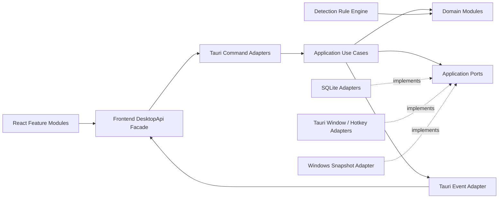

# 02. 系统架构设计

## 1. 技术栈

- Tauri 2；
- React + TypeScript + Vite；
- Tailwind CSS + shadcn/ui + Lucide；
- Rust；
- SQLite，由 Rust 数据层访问；
- Windows API 与进程信息由 Rust 平台层访问；
- pnpm 作为前端包管理器；
- Vitest、React Testing Library、Playwright；
- Rust 内置测试、Clippy、rustfmt。

依赖版本在项目初始化时选择兼容的稳定版本，并由 `pnpm-lock.yaml` 与 `Cargo.lock` 锁定。

## 2. 架构目标

架构必须同时满足：

1. UI 可以在浏览器 + MockDesktopApi 下独立开发和测试；
2. 领域规则不依赖 Tauri、SQLite、Windows API；
3. 新增 Agent 优先添加数据规则，不复制 detector；
4. 新增提醒方式、平台适配器或存储实现时，不修改便签核心模型；
5. 快捷键捕获、验证、系统注册和持久化分层实现；
6. 每个功能模块有单一职责、公开入口和清晰依赖方向；
7. AI 生成代码时可以按模块局部修改，而不需要理解整个仓库。

## 3. 总体架构



依赖只能指向内层：

```text
UI → Frontend Adapter → Tauri Adapter → Application → Domain / Ports
Infrastructure / Platform ─implements→ Ports
Domain → 不依赖任何外部框架
```

## 4. 功能模块

| 模块          | 核心职责                      | 公开入口                          | 禁止承担                |
| ------------- | ----------------------------- | --------------------------------- | ----------------------- |
| `tips`        | Tip、自由标签的生命周期与查询 | Tip use cases / repository port   | 窗口、快捷键、检测      |
| `agents`      | Agent 与规则配置              | Agent use cases / repository port | 直接读取 Win32          |
| `bindings`    | Tip-Agent 多对多和 autoAttach | Binding service                   | 冷却状态                |
| `hotkey`      | 快捷键值对象、策略、注册切换  | UpdateHotkey use case             | React 键盘 UI           |
| `detection`   | 快照解析、评分、歧义处理      | ResolveAgent use case             | 弹提醒或写 UI           |
| `activation`  | 去抖、context signature       | Activation service                | 查询便签正文            |
| `reminder`    | 资格、冷却、聚合 payload      | HandleAgentActivated use case     | 读取 Windows 进程       |
| `windows`     | 窗口生命周期和托盘            | WindowController port adapter     | 领域判断                |
| `settings`    | 持久化应用配置                | Settings repository / use cases   | 任意散落 key-value 访问 |
| `diagnostics` | 脱敏诊断快照与日志            | Diagnostics facade                | 存储便签正文日志        |

模块间协作必须通过 use case、port 或稳定 DTO，不得跨目录直接访问另一个模块的私有 repository 或内部状态。

## 5. 前端边界

### 5.1 Frontend Feature Modules

前端以功能目录组织，而不是按 `components/hooks/utils` 全局堆放：

```text
src/features/
├── quick-note/
├── note-library/
├── agent-manager/
├── hotkey-settings/
├── reminder/
├── diagnostics/
└── settings/
```

每个 feature 包含自己的组件、状态、schema 和测试；跨 feature 复用内容进入 `components/shared` 或 `lib`。

### 5.2 DesktopApi Facade

组件中不得散落 `invoke()` 与 `listen()`。统一接口示例：

```ts
export interface DesktopApi {
  createTip(input: CreateTipInput): Promise<TipDto>;
  updateTip(input: UpdateTipInput): Promise<TipDto>;
  listTips(query: TipQuery): Promise<TipPageDto>;
  listTags(): Promise<string[]>;
  listAgents(): Promise<AgentDto[]>;
  getHotkey(): Promise<HotkeyBindingDto>;
  updateHotkey(input: HotkeyCandidateDto): Promise<HotkeyUpdateResultDto>;
  openMainWindow(filter?: MainWindowFilter): Promise<void>;
  hideCurrentWindow(): Promise<void>;
  subscribeReminder(handler: (event: ReminderPayload) => void): Unsubscribe;
}
```

生产环境使用 `TauriDesktopApi`，浏览器测试使用 `MockDesktopApi`。

### 5.3 HotkeyRecorder

`HotkeyRecorder` 只负责：

- 进入/退出录制状态；
- 捕获 `KeyboardEvent.code`；
- 生成 `{ modifier: 'Ctrl', keyCode }` 候选；
- 展示格式错误、冲突警告和后端结果。

它不得：

- 自己决定系统是否可注册；
- 直接调用 Tauri global shortcut API；
- 持久化设置；
- 维护一份与 Rust 不同的最终支持键规则。

## 6. Rust 分层与 Ports

### 6.1 Domain

领域层按能力拆分：

```text
src-tauri/src/domain/
├── tips/
├── agents/
├── hotkey/
├── detection/
├── activation/
└── reminder/
```

领域层只包含实体、值对象、纯规则和错误，不引用 `tauri`、SQLite crate、`windows` crate 或全局单例。

### 6.2 Application

应用层按用例命名，而不是建立一个万能 Service：

```text
application/
├── tips/create_tip.rs
├── tips/update_tip.rs
├── hotkey/get_hotkey.rs
├── hotkey/update_hotkey.rs
├── detection/resolve_foreground.rs
└── reminder/handle_agent_activated.rs
```

### 6.3 Ports

关键端口：

```rust
trait TipRepository { /* ... */ }
trait AgentRepository { /* ... */ }
trait SettingsRepository { /* ... */ }
trait ActivationStateRepository { /* ... */ }
trait Clock { /* ... */ }
trait HotkeyRegistrar { /* register / unregister */ }
trait WindowController { /* show / hide / focus policy */ }
trait ForegroundSnapshotProvider { /* snapshot */ }
trait EventPublisher { /* stable domain events */ }
trait ClipboardPort { /* user-triggered copy only */ }
```

应用用例依赖端口，SQLite、Tauri 与 Windows 代码实现端口。

## 7. 快捷键模块设计

### 7.1 领域值对象

```rust
struct HotkeyBinding {
    modifier: RequiredModifier, // 仅 Ctrl
    key_code: SupportedKeyCode,
}
```

`HotkeyBinding` 负责规范化和序列化，不接受任意字符串。`HotkeyPolicy` 负责：

- 必须且只能包含 Ctrl；
- 恰好一个非修饰键；
- 支持键集合；
- Esc 与纯修饰键拒绝；
- 高冲突组合警告分类。

### 7.2 更新用例

`UpdateHotkey` 使用 `HotkeyRegistrar` 和 `SettingsRepository`：

1. Rust 解析并验证候选；
2. 若与当前值相同，幂等返回；
3. 注册新组合；
4. 注册失败时保留旧组合并返回结构化错误；
5. 持久化新值；
6. 持久化失败时注销新组合，旧组合继续有效；
7. 提交内存中的当前 binding；
8. 注销旧组合；若注销失败，旧回调必须通过 generation/current-binding 校验而不再执行业务动作；
9. 发布 `settings/changed`。

快捷键回调只调用 `OpenQuickNote` 用例，不直接查询数据库或执行耗时逻辑。

## 8. 推荐目录

```text
agent-tips/
├── src/
│   ├── app/
│   ├── features/
│   │   ├── quick-note/
│   │   ├── note-library/
│   │   ├── agent-manager/
│   │   ├── hotkey-settings/
│   │   ├── reminder/
│   │   └── diagnostics/
│   ├── components/ui/
│   ├── components/shared/
│   ├── desktop-api/
│   │   ├── contract.ts
│   │   ├── tauri-adapter.ts
│   │   └── mock-adapter.ts
│   ├── schemas/
│   └── styles/
├── src-tauri/
│   ├── src/
│   │   ├── commands/
│   │   ├── application/
│   │   ├── domain/
│   │   ├── ports/
│   │   ├── adapters/
│   │   │   ├── sqlite/
│   │   │   ├── tauri/
│   │   │   └── windows/
│   │   ├── detection/
│   │   ├── events/
│   │   ├── bootstrap/
│   │   └── error.rs
│   └── migrations/
├── e2e/
├── scripts/
└── docs/
```

## 9. 窗口生命周期

### 9.1 主窗口

- 应用启动时可隐藏或显示，首次开发阶段默认显示；
- 关闭行为改为隐藏到托盘；
- 再次启动应用时由单实例插件聚焦主窗口。

### 9.2 快捷窗口

- 启动时预创建并隐藏，减少首次唤起延迟；
- 当前有效快捷键触发时重置为新建状态；
- 定位到当前屏幕中心或上次位置；
- 保存或取消后隐藏，不销毁。

### 9.3 提醒窗口

- 推荐预创建以减少延迟；
- Rust 先确定提醒资格和 payload，再发事件并显示窗口；
- 窗口显示成功后提交 `last_prompted_at`；
- 必须使用不抢焦点的窗口显示方式。

## 10. 后台检测循环

MVP 推荐简单、可测试的轮询：

1. 每 500 ms 读取前台窗口句柄与 PID；
2. 仅当前台 PID 或标题签名变化时读取更详细信息；
3. 终端宿主成为前台时刷新相关进程树；
4. 检测结果稳定 750 ms 后产生候选激活；
5. 相同 `context_signature` 不重复产生候选激活；
6. 将候选激活交给 Reminder 用例，而不是直接弹窗。

## 11. 并发与生命周期

- Windows 检测在可取消后台任务中运行；
- UI Command 不得被检测循环阻塞；
- SQLite 操作保持短事务；
- 不在数据库锁内执行窗口或快捷键注册；
- Event payload 必须拥有数据，不传数据库引用或锁；
- 后台任务和事件监听在退出时释放；
- 快捷键录制仅发生在前端控件聚焦期间，不创建全局键盘监听器。

## 12. 日志

结构化日志至少包含：

- 应用启动与版本；
- 数据库迁移；
- 快捷键候选的结果码、注册成功或冲突（不记录连续按键历史）；
- Agent 候选与最终识别结果；
- 提醒被允许或拒绝的原因码；
- 窗口创建错误；
- 未处理错误。

默认日志不得记录完整便签正文、敏感路径、完整命令行或用户录制期间的原始按键序列。
