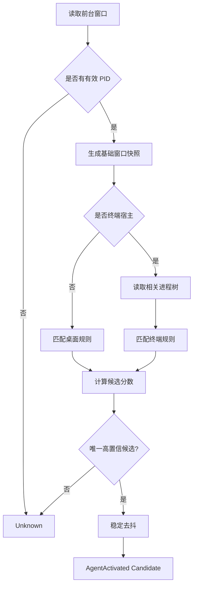

# 04. Agent 检测设计

## 1. 目标与限制

检测目标是回答：

> 当前系统前台是否是一个已配置 Agent？若是，最可信的 Agent 和上下文签名是什么？

MVP 不追求读取 Agent 内部会话，不读取网页 DOM，不注入 IDE。检测基于 Windows 前台窗口、进程、窗口标题和终端子进程。

## 2. 输入快照

平台层生成标准化快照：

```rust
pub struct ForegroundSnapshot {
    pub captured_at: DateTime<Utc>,
    pub window_handle: isize,
    pub foreground_pid: u32,
    pub process_name: Option<String>,
    pub executable_path: Option<String>,
    pub window_title: Option<String>,
    pub window_class: Option<String>,
    pub process_tree: Vec<ProcessNode>,
}

pub struct ProcessNode {
    pub pid: u32,
    pub parent_pid: Option<u32>,
    pub name: String,
    pub executable_path: Option<String>,
    pub command_line: Vec<String>,
}
```

读取失败的字段应为 `None` 或空集合，不因为单字段失败而让检测线程崩溃。

## 3. 检测流程



## 4. 数据驱动规则

不得为每种 Agent 写独立的巨大 detector。使用共享规则引擎：

```text
candidate_score = Σ matched_rule.weight
```

建议权重：

| 规则               | 默认权重 |
| ------------------ | -------: |
| 精确可执行文件路径 |      100 |
| 精确前台进程名     |       60 |
| 窗口类名           |       40 |
| 窗口标题正则       |       25 |
| 终端子进程精确名   |       70 |
| 终端命令行正则     |       80 |

要求：

- 至少命中一个“强规则”或达到最小阈值；
- 两个候选分数接近时返回 Unknown，不猜测；
- 用户自定义规则可以覆盖内置规则，但必须可恢复默认；
- 所有正则编译失败时在设置页提示并禁用该规则。

## 5. 桌面 Agent

桌面 Agent 只有在其窗口是前台窗口时才算激活。后台存在 `Cursor.exe` 不触发提醒。

识别信息优先级：

1. 可执行文件路径；
2. 前台进程名称；
3. 窗口类名；
4. 窗口标题。

窗口标题只能作为辅助，因为标题通常包含项目名或文档名，会变化。

## 6. 终端 Agent

### 6.1 终端宿主

初始宿主集合可包含：

- Windows Terminal；
- PowerShell / pwsh；
- cmd；
- 其他用户自定义终端。

### 6.2 识别条件

只有终端宿主在前台时，才检查其后代进程。根据父子 PID 构建树，并匹配：

- 子进程名；
- 可执行路径；
- 命令行参数；
- 进程深度；
- 规则权重。

禁止使用“存在任意 `node.exe` 就是 Claude Code”之类的弱判断。

若多个 Agent 同时运行：

- 优先选择与前台终端树有父子关系的候选；
- 优先选择更深层、命令行明确命中的候选；
- 仍无法区分时返回 Unknown。

### 6.3 命令行权限失败

某些进程命令行可能无法读取。此时：

- 退化到进程名和路径规则；
- 降低候选置信度；
- 不弹出错误通知；
- 在诊断页面记录脱敏原因。

## 7. 去抖与上下文签名

候选 Agent 需要稳定存在 750 ms 才确认。上下文签名建议：

```text
agent_id + foreground_pid + normalized_window_handle_or_terminal_root_pid
```

用途：

- 过滤同一窗口标题频繁变化；
- 防止轮询重复产生激活；
- 记录诊断。

窗口标题不要直接完整进入签名，以免 IDE 标题变化导致重复激活。

## 8. 识别结果

```rust
pub struct AgentContext {
    pub agent_id: Uuid,
    pub agent_key: String,
    pub kind: AgentKind,
    pub confidence: u16,
    pub context_signature: String,
    pub detected_at: DateTime<Utc>,
    pub diagnostics: Vec<MatchedRuleSummary>,
}
```

`diagnostics` 默认只在设置页使用，不发送完整敏感命令行到前端。

## 9. 可测试性

平台读取与规则引擎必须解耦：

```rust
pub trait ForegroundSource {
    fn snapshot(&self) -> Result<ForegroundSnapshot, PlatformError>;
}

pub trait AgentResolver {
    fn resolve(&self, snapshot: &ForegroundSnapshot) -> Resolution;
}
```

自动测试使用 fixture 构造：

- Cursor 前台；
- Cursor 后台、浏览器前台；
- Windows Terminal → PowerShell → Claude Code；
- Windows Terminal → Node 开发服务器；
- 同一终端树存在 Claude Code 和 OpenCode 的歧义；
- 无权限读取命令行；
- 错误正则；
- 窗口快速切换抖动。

## 10. 诊断界面

设置页提供“检测诊断”，显示：

- 当前前台进程名；
- 当前识别 Agent 或 Unknown；
- 命中的规则摘要；
- 置信分；
- 最近 20 次识别变化；
- “将当前窗口配置为新 Agent”入口。

默认不显示完整命令行和绝对路径；用户主动展开时才展示，并提示可能包含敏感信息。
