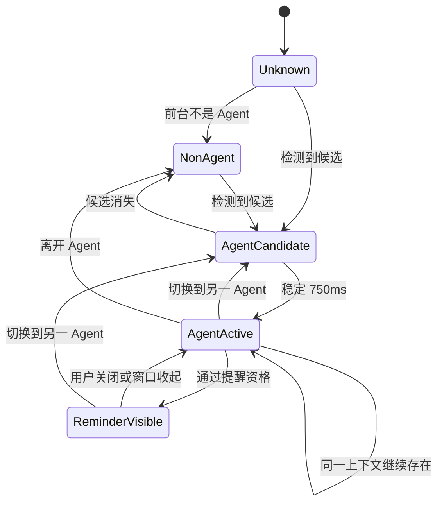

# 05. 自动提醒状态机

## 1. 核心规则

当 Agent 被确认激活后，只有同时满足以下条件才显示提醒：

1. 全局自动提醒未暂停；
2. Agent 已启用；
3. Agent 的 `reminder_enabled = true`；
4. Agent 至少有一条有效 `auto_attach = true` 便签；
5. `last_prompted_at` 为空，或距当前时间已满 15 分钟；
6. 当前没有该 Agent 正在展示的提醒窗口；
7. 提醒窗口可成功显示。

15 分钟固定为：

```text
COOLDOWN = 15 * 60 seconds
```

MVP 不在 UI 中允许修改冷却时长，只允许按 Agent 开关自动提醒。未来可配置，但不能提前实现。

## 2. 状态

```text
Unknown
NonAgent
AgentCandidate(agent)
AgentActive(agent)
ReminderVisible(agent)
```

状态转换：



## 3. 资格判断伪代码

```rust
fn evaluate_reminder(
    now: Instant,
    global: &GlobalReminderSettings,
    agent: &Agent,
    activation: &AgentActivationState,
    tips: &[AttachedTip],
    visible_agent: Option<AgentId>,
) -> ReminderDecision {
    if global.paused {
        return Deny(GlobalPaused);
    }
    if !agent.enabled {
        return Deny(AgentDisabled);
    }
    if !agent.reminder_enabled {
        return Deny(AgentReminderDisabled);
    }
    if tips.is_empty() {
        return Deny(NoAttachedTips);
    }
    if visible_agent == Some(agent.id) {
        return Deny(AlreadyVisible);
    }
    if let Some(last) = activation.last_prompted_at {
        if now - last < FIFTEEN_MINUTES {
            return Deny(CooldownActive);
        }
    }
    Allow(ReminderPayload::from(tips))
}
```

## 4. 时间语义

- 使用 UTC 持久化时间；
- 使用抽象 `Clock` 获取当前时间；
- 测试通过 FakeClock 前进时间，不真实等待；
- 冷却比较采用 `now >= last_prompted_at + 15 minutes`；
- 系统时间向后跳时，保守处理为仍在冷却，且记录诊断；
- 应用重启后从数据库恢复冷却，不因重启立即再次弹出。

## 5. `last_prompted_at` 更新时机

只在以下流程成功后更新：

1. 资格判断允许；
2. 读取到至少一条携带便签；
3. reminder 窗口收到 payload；
4. 窗口显示调用返回成功。

以下情况不得更新：

- 没有携带便签；
- reminder 窗口创建失败；
- 前端渲染事件未成功投递；
- Agent 识别失败；
- 仍在冷却；
- 用户关闭了 Agent 自动提醒。

## 6. 多 Agent 独立性示例

| 时间  | 操作               | 结果                               |
| ----- | ------------------ | ---------------------------------- |
| 22:00 | 进入 Cursor        | 显示 Cursor 提醒                   |
| 22:05 | 进入 Claude Code   | 显示 Claude Code 提醒              |
| 22:10 | 再进入 Cursor      | 不显示，Cursor 冷却中              |
| 22:17 | 再进入 Claude Code | 不显示，Claude Code 仅过去 12 分钟 |
| 22:20 | 再进入 Cursor      | 显示，Cursor 已满 20 分钟          |
| 22:21 | 进入 OpenCode      | 按 OpenCode 独立状态判断           |

## 7. 同一 Agent 的窗口切换

- Cursor 主窗口 → Cursor 设置窗口：若仍解析为同一 Agent，不触发新提醒；
- Cursor → 浏览器 → Cursor：产生新的激活候选，但冷却可能拒绝；
- Claude Code 的终端标题变化：上下文签名稳定时不产生新激活；
- 应用从睡眠恢复：重新读取前台状态，仍遵守数据库冷却。

## 8. 提醒内容

提醒 payload 包含当前所有有效携带便签，但 UI 首屏最多展示 3 条。Rust 返回完整列表或受控上限，前端负责首屏折叠。

顺序使用数据库文档定义的稳定顺序。一次提醒只生成一个聚合窗口，不为每条便签创建单独窗口。

## 9. 决策原因码

为了测试和诊断，资格判断必须返回原因：

```text
Allowed
GlobalPaused
AgentDisabled
AgentReminderDisabled
NoAttachedTips
CooldownActive
AlreadyVisible
WindowShowFailed
UnknownAgent
```

不要仅返回 `bool`。

## 10. 必测边界

- 第一次激活；
- 14:59 后激活；
- 恰好 15:00 后激活；
- 15:01 后激活；
- 不同 Agent 独立冷却；
- 应用重启后恢复；
- 无携带便签不更新时间；
- 窗口显示失败不更新时间；
- 全局暂停；
- Agent 级关闭；
- 提醒已显示时重复事件；
- 系统时间向后变化。
