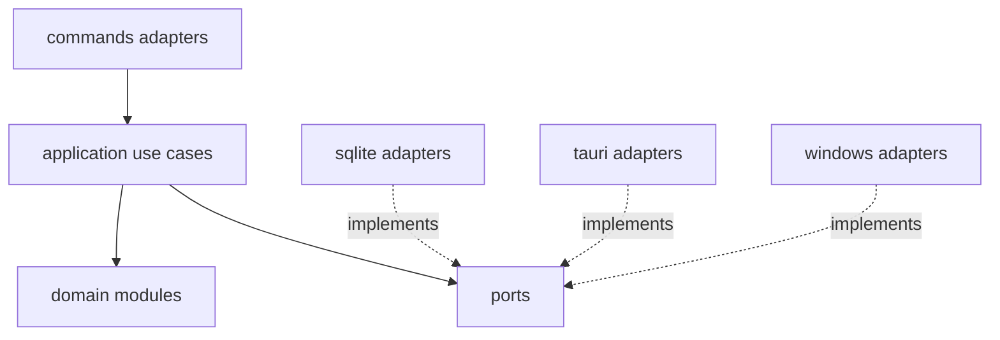
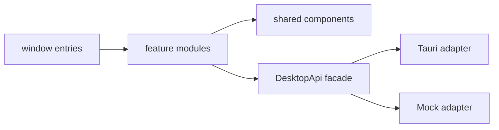

# 12. 可扩展性与模块设计

## 1. 目标

本项目的“可扩展”不是预先实现所有未来能力，而是保证新增能力可以局部接入：

- 新增桌面或终端 Agent，不修改提醒状态机；
- 新增平台适配器，不修改领域模型；
- 新增提醒展示方式，不修改检测引擎；
- 新增设置项，不让业务组件直接读写 SQLite；
- 调整快捷键支持键集合，不改动录制 UI 的核心流程；
- AI Agent 可以只阅读一个模块及其契约完成修改。

## 2. 模块原则

1. **按业务能力切分：** tips（含用户标签）、agents、hotkey、detection、activation、reminder、settings。
2. **依赖倒置：** application 依赖 port，外部适配器实现 port。
3. **领域纯净：** domain 不导入框架与 I/O。
4. **单一写入者：** 每类状态由一个模块负责，例如冷却只由 reminder/activation 更新。
5. **稳定契约：** 跨模块使用 DTO、domain event 或 port，不引用私有实现。
6. **数据驱动优先：** Agent 差异优先通过 AgentRule 表达，而不是新建 if/else。
7. **适度抽象：** 只有存在明确替换点或测试替身需求时才定义 trait，不建立无用途的泛型框架。

## 3. Rust 模块依赖图



禁止：

- domain → application/adapters/Tauri/SQLite/Windows；
- application → 具体 SQLite struct 或 Tauri AppHandle；
- detection engine → reminder window；
- command adapter → SQL；
- 任意模块直接访问另一个模块的内部数据库连接。

## 4. 前端模块依赖图



规则：

- `features/x` 只能导入自身文件、shared、schemas 和 DesktopApi；
- feature A 不直接导入 feature B 的私有组件或 store；
- 多 feature 协作通过 app 层 composition 或共享 use-case hook；
- `@tauri-apps/api` 只允许出现在 adapter/bootstrap 白名单目录；
- 后端 DTO 在 desktop-api 层转换为前端 view model，避免组件依赖传输细节。

## 5. 关键扩展点

### 5.1 新增 Agent

优先步骤：

1. 新增 Agent seed 或用户自定义 Agent；
2. 增加 AgentRule；
3. 添加 fixture；
4. 运行相同检测引擎。

只有出现现有快照无法表达的新系统信息时，才扩展 `ForegroundSnapshotProvider`，不得为单个 Agent 复制完整 detector。

### 5.2 新增平台

实现平台端口：

- `ForegroundSnapshotProvider`；
- `HotkeyRegistrar`；
- `WindowController`；
- `AutostartPort`；
- `SingleInstancePort`。

领域层和应用用例不感知 Windows/macOS/Linux。

### 5.3 新增提醒方式

提醒资格和提醒呈现分离：

```text
ReminderDecision → ReminderPayload → ReminderPresenter
```

未来若增加系统通知、边缘胶囊或 CLI 输出，只新增 presenter adapter；15 分钟规则不复制。

### 5.4 扩展快捷键规则

- 支持键集合由 `SupportedKeyCode` 与 `HotkeyPolicy` 统一维护；
- 前端可通过 settings metadata 获取可展示信息，但 Rust 始终进行权威校验；
- 若未来允许其他修饰键，需要提升 schemaVersion 和迁移，不直接放宽字符串解析；
- `HotkeyRegistrar` 隔离 Tauri 插件，测试使用 FakeHotkeyRegistrar。

### 5.5 更换存储

Repository ports 隔离 SQLite。MVP 只有 SQLite adapter，但领域与用例不得依赖 SQL 细节。禁止为了“未来云同步”提前实现远程 repository。

## 6. 模块公开 API

每个 Rust 模块至少包含：

```text
mod.rs / facade.rs       公开类型和用例入口
model.rs                 模块实体和值对象
error.rs                 模块错误
ports.rs                 必要端口（若存在 I/O）
tests/                   纯逻辑与契约测试
```

每个前端 feature 至少包含：

```text
index.ts                 唯一公开出口
components/              私有 UI
model/ or schema.ts      输入与 view state
hooks/                    feature use cases
*.test.tsx               测试
```

禁止通过深层相对路径绕过 `index.ts` 导入其他 feature 私有实现。

## 7. 事件设计

领域事件只描述已经发生的稳定事实：

- `AgentActivatedCandidate`；
- `ReminderPrepared`；
- `HotkeyChanged`；
- `GlobalPauseChanged`。

事件中不放 repository、AppHandle、数据库连接或 UI callback。事件名称和 payload 版本化，避免每个窗口自行监听低级系统事件。

## 8. 配置与版本化

- 复杂设置使用带 `schemaVersion` 的结构化 JSON；
- migration 负责数据库形状，setting migrator 负责 JSON schema；
- 新字段提供默认值并保持向后兼容；
- 内置 Agent 规则带版本，升级时不得静默覆盖用户修改；
- 可采用“内置默认规则版本 + 用户 override”模型，但不在 MVP 提前实现复杂同步。

## 9. 架构自动验收

必须提供 `scripts/check-architecture.*` 或等价 lint 配置，至少检查：

1. Rust `domain/` 不包含 `tauri::`、SQLite crate 或 `windows::` import；
2. React feature 不直接导入 `@tauri-apps/api`；
3. 前端不存在 SQL 查询字符串或 Tauri SQL 插件访问；
4. feature 之间不通过私有路径深层导入；
5. detection 内不依赖 reminder/window adapter；
6. 单个新增测试 Agent 可只通过规则 fixture 接入。

架构检查必须进入 `scripts/acceptance.ps1`，不能只依靠代码审查。

## 10. AI 修改规则

代码 Agent 修改模块时必须：

1. 先指出目标模块和公开契约；
2. 列出需要调用的其他模块接口；
3. 不顺手重构无关模块；
4. 新增跨模块依赖时说明原因；
5. 更新对应单元、契约或架构测试；
6. 若现有接口无法支持需求，先扩展 port/DTO，再实现 adapter，禁止直接穿透层级。

## 11. 反模式

以下结构禁止出现：

- `AppService` 管理便签、快捷键、检测、窗口和数据库；
- `utils.rs` 存放业务规则；
- React 全局 store 保存所有窗口、数据库和冷却状态；
- 每个 Agent 一个独立 detector 并复制流程；
- 前端和 Rust 各维护一套快捷键合法集合；
- command 函数中直接写 SQL、注册快捷键并渲染文案；
- 为未来功能提前创建未被使用的抽象层。
