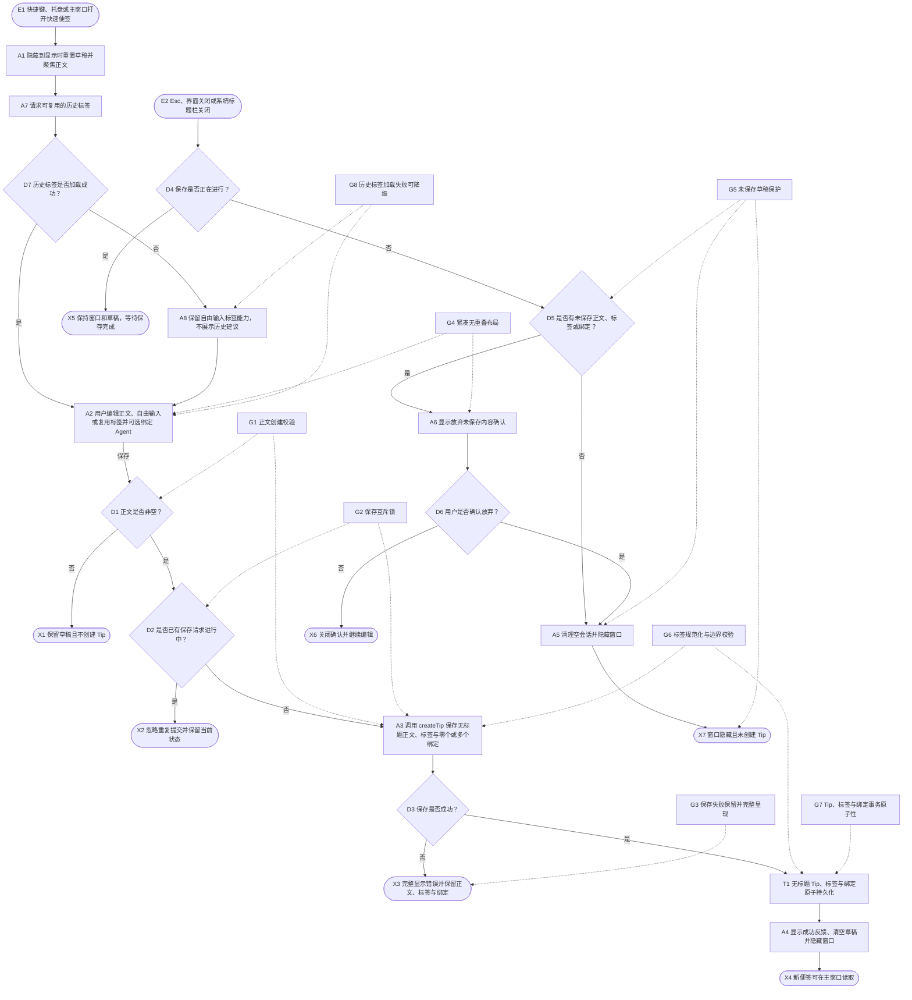
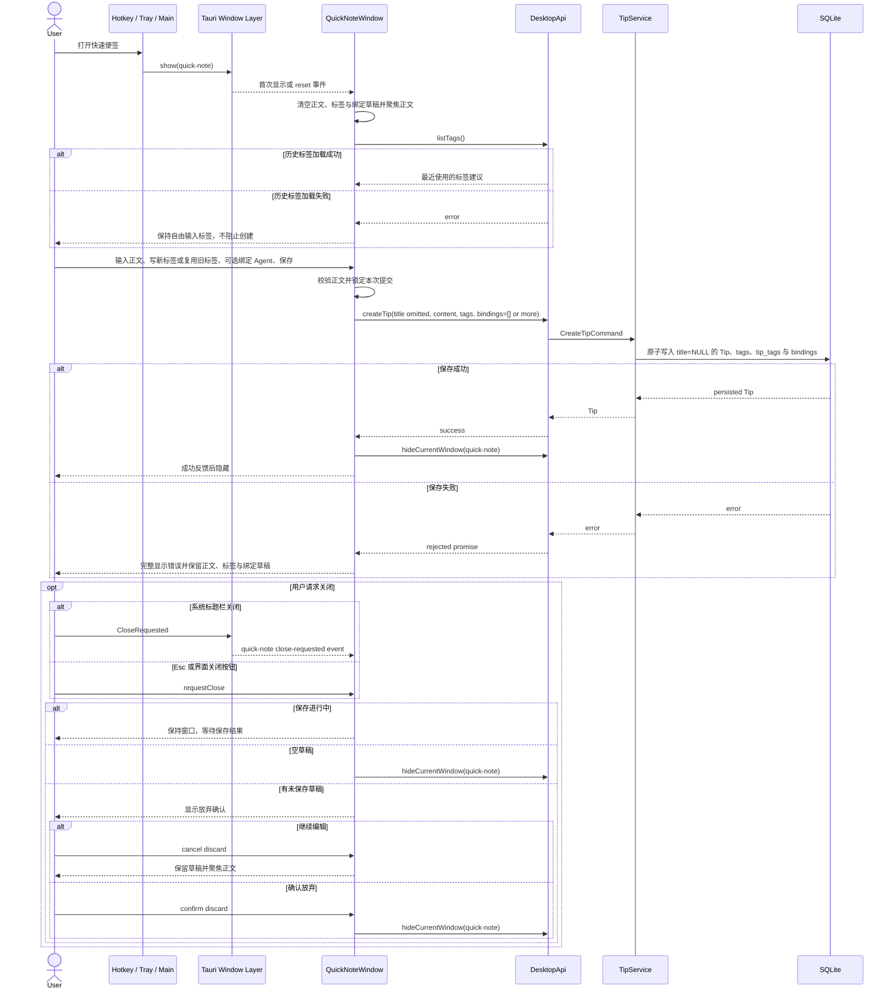
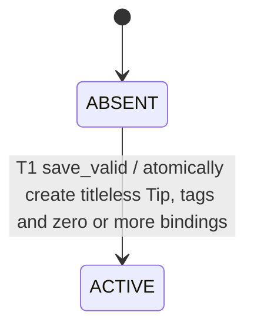

# Create a quick note

## Purpose

让用户从全局快捷键、托盘或主窗口快速打开一个紧凑便签，在无标题、正文无边框的纸面上记录内容，自由输入标签或复用以前写过的标签，再按需绑定零个或多个 Agent。历史标签只是输入建议，不是固定分类；建议加载失败也不能阻止新标签输入。所有关闭入口都必须保护未保存的正文、标签和绑定。

## Entry, preconditions, and terminal outcomes

- Create entry: 全局快捷键、托盘菜单或主窗口“新建提示”动作显示 `quick-note` 窗口。
- Close entry: 用户按 `Esc`、点击便签内关闭按钮，或点击系统标题栏关闭按钮。
- Save preconditions: 正文去除首尾空白后非空，并且同一时刻没有正在进行的保存请求；标签由用户自由输入，历史标签仅作为可复用建议，标签与 Agent 绑定均可为空。
- Save success: 标题保持为空，Tip、规范化标签与零个或多个 Agent 绑定被原子持久化；界面显示短暂成功反馈，清空草稿并隐藏窗口。
- Save rejection: 正文为空或已有保存请求时不调用创建接口，窗口继续显示当前草稿。
- Save failure: 创建失败时完整显示可滚动、可选择的错误文本，正文、标签输入、已选标签、绑定和窗口可见状态都保持不变。
- Close success: 空草稿直接隐藏；非空草稿只有在用户明确确认放弃后才清空并隐藏。
- Close cancellation: 用户选择继续编辑，或保存仍在进行时，窗口保持可见且草稿不变。

## Runtime flow

## Component sequence

## State lifecycle

## Safeguards

- `G1`：只有正文为空时禁止创建；没有 Agent 不再阻止保存。
- `G2`：保存进行期间使用同步互斥标记抑制重复点击和连续快捷键提交。
- `G3`：创建异常不清空草稿、不隐藏窗口；错误全文可滚动查看和选择复制。
- `G4`：默认与最小窗口尺寸下，正文、Agent 列表、错误和放弃确认都不溢出或互相遮挡。
- `G5`：Esc、界面关闭和系统标题栏关闭统一经过同一草稿检查；非空草稿没有明确确认就不能被清空或隐藏。
- `G6`：标签去除多余空白与前导 `#`，按大小写不敏感去重；超出数量或长度边界时拒绝创建且不产生持久化副作用。
- `G7`：Tip、首次出现的标签、Tip-Tag 关联和 Agent 绑定在同一 SQLite 事务提交，任一步失败都不留下部分记录。
- `G8`：历史标签建议是增强能力；读取失败时仍保留自由输入，不让辅助查询阻断快速记录。

## Failure, recovery, and observability

创建调用不自动重试，避免一次用户动作产生重复便签。失败由窗口内 `alert` 完整呈现，并保留可编辑的正文、标签和绑定草稿，用户确认后手动重试。历史标签建议读取失败静默降级为自由输入；重复提交被本地互斥标记直接忽略。系统标题栏关闭事件若成功送达前端，由同一关闭协调器处理；监听失败时不静默隐藏快速便签，避免丢稿优先于关闭便利。当前链路没有额外日志、指标或告警；持久化错误沿既有 Desktop API 错误通道返回。

## Implementation notes

快速便签不提交显式标题，后端与 Mock adapter 都保持标题为空，不再从正文派生标题。新标签由用户自由输入；已持久化标签只作为后续输入建议并可点击复用。零标签或零 Agent 的便签仍是合法 Active Tip，之后可在详细编辑器中调整标签与绑定。机器可读的代码与测试映射维护在 `traceability.yaml`。
